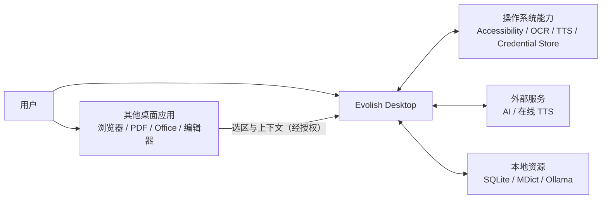
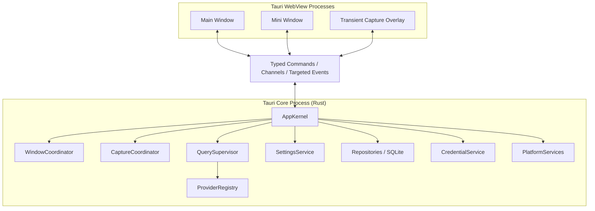
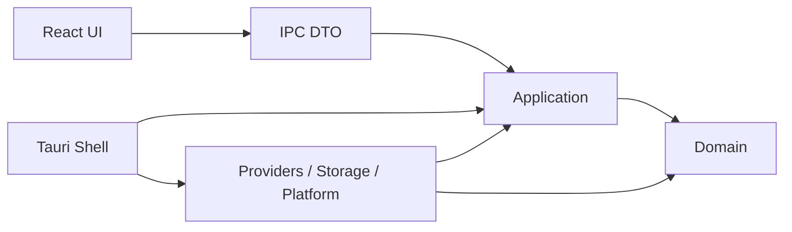
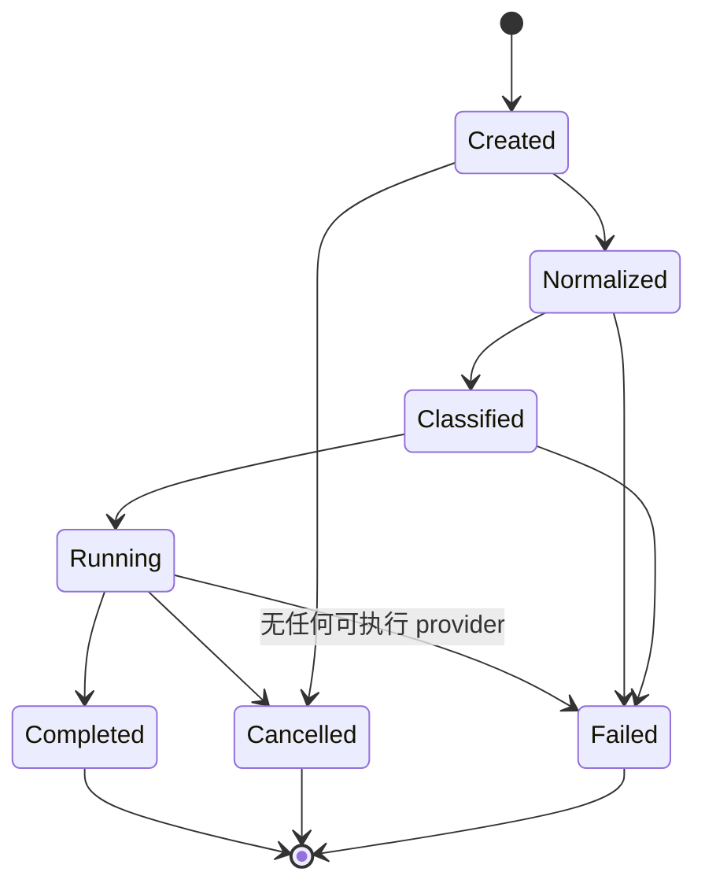
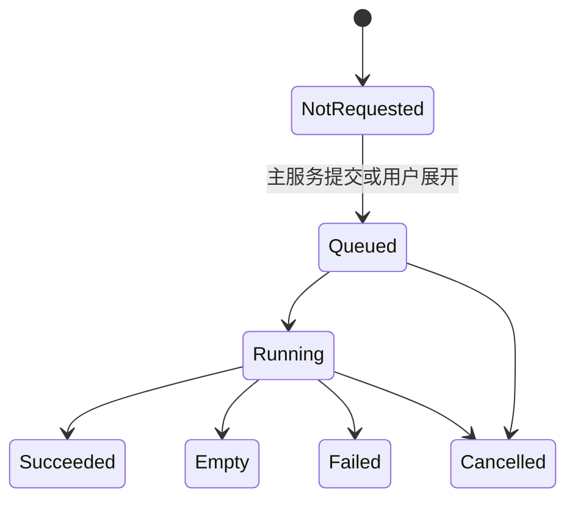

# Evolish 技术总体方案与应用架构

> 状态：Accepted
> 日期：2026-08-11
> 已确认基础栈：[ADR-0001](./adr/0001-desktop-technology-stack.md)
> AI 翻译编排：[ADR-0005](./adr/0005-ai-only-translation-and-on-demand-query.md)
> 窗口模型：[ADR-0006](./adr/0006-two-window-product-model.md)
> 产品范围：[阶段一 PRD](../reference/pm/phase-1-prd.md)
> 功能范围：[Easydict 功能对齐基线](../reference/pm/easydict-feature-baseline.md)

## 1. 架构目标

本架构必须同时满足以下目标：

1. 三个桌面平台共享查询、服务、数据和大部分 UI 逻辑。
2. 取词、OCR、TTS、词典、凭据和特殊窗口允许使用平台原生实现。
3. 主窗口与迷你窗口看到同一份核心状态，不在各 WebView 内复制业务状态。
4. 首次只执行主 AI 服务，其他服务由用户展开后按需执行；各服务状态相互隔离。
5. 新查询能可靠取消或隔离旧查询，旧结果不能污染当前窗口。
6. 密钥和敏感系统能力不进入前端 WebView。
7. 阶段二可消费阶段一的结构化查询数据，而无需重写查询核心。
8. 初始工程保持模块化单体，不引入本地微服务、动态代码加载或额外运行时。

## 2. 架构风格

采用 **模块化单体 + Ports/Adapters（端口与适配器）**。

- **模块化单体**：应用只有一个 Rust 核心进程，统一持有数据库、配置、任务和窗口协调器。
- **Ports/Adapters**：领域与应用层只依赖能力接口；AI 服务、数据库和操作系统分别实现这些接口。
- **前端双窗口**：主窗口与迷你窗口是同一核心的两个受控视图；设置是主窗口内路由，截图遮罩是一次性捕获表面，不是结果窗口。

明确不采用：

- 本地 HTTP 服务作为前后端通信通道；
- 每个窗口独立请求翻译服务；
- 前端直接读写 SQLite；
- 阶段一动态加载第三方二进制插件；
- 将 macOS/Windows/Linux 分成三个独立产品代码库。

## 3. 系统上下文



## 4. 运行时容器



### 单实例原则

- 桌面进程只能有一个运行实例。
- 第二次启动、深度链接和文件关联请求转发给已运行实例。
- 已运行实例根据请求决定展示哪个窗口和执行何种查询。
- 单实例不是单窗口：核心进程管理多个受控 WebView 窗口。

## 5. Rust 核心模块

### 5.1 `domain`

纯 Rust 领域模型与规则，不依赖 Tauri、SQLx、Reqwest 或操作系统 API。

主要对象：

- `QuerySessionId`
- `QuerySession`
- `SourceContent`
- `SourceContext`
- `Language`
- `LanguagePair`
- `QueryIntent`
- `ProviderId`
- `ProviderCapability`
- `ProviderRequest`
- `ProviderResult`
- `TranslationAttempt`
- `DictionaryEntry`
- `AdaptiveTranslationResult`
- `FavoriteReference`
- `SpeechRequest`
- `AppError`

### 5.2 `application`

实现应用用例与协调逻辑：

- `StartQuery`
- `CancelQuery`
- `RetryProvider`
- `CaptureSelection`
- `CaptureScreenRegion`
- `RecognizeImage`
- `SpeakText`
- `UpdateSettings`
- `TestProviderConfiguration`
- `OpenWindow`

该层依赖领域对象和端口接口，不依赖具体服务实现。

### 5.3 `query`

`QuerySupervisor` 管理查询生命周期：

- 文本规范化与语言判断；
- 意图分类：词、句子、长文本、明确翻译；
- 根据窗口 profile 选择主 AI provider 和可按需请求的其他 provider；
- 默认只调度主 provider，接收用户展开动作后才调度指定的其他 provider；
- 管理每服务超时、并发限制、attempt 版本和完整结果事件；
- 取消旧会话；
- 防止过期结果写入当前窗口；
- 生成可脱敏诊断信息。

每个窗口槽位拥有一个 active session。固定窗口可以保留当前会话，并由新窗口槽位接收下一次查询。

### 5.4 `providers`

按能力拆分接口，避免一个不断膨胀的万能 trait：

```text
DictionaryProvider
AiTranslationProvider
SpeechProvider
```

共享 `ProviderDescriptor`：

- 身份与显示信息；
- 能力类型；
- 支持语言；
- 支持的查询意图；
- 配置字段描述；
- 认证要求；
- 速率和文本长度约束；
- 是否为本地服务；
- 隐私说明。

阶段一 provider 在编译期注册。AI 翻译原生 adapter 为 OpenAI、Anthropic 和 Gemini，并提供 OpenAI-compatible 通用 adapter；传统翻译 adapter 不进入 registry。UI 根据 descriptor 生成一致的配置表单，Rust 后端执行最终校验。

### 5.5 `platform`

定义平台能力端口：

```text
TextCapturePort
ScreenCapturePort
OcrPort
SpeechPort
SystemDictionaryPort
PermissionPort
WindowBehaviorPort
CredentialPort
ExternalIntegrationPort
```

每个平台在启动时生成 `PlatformCapabilityReport`。UI 和用例依据能力报告显示真实可用功能，不能用操作系统名称进行散落判断。

### 5.6 `storage`

- SQLite 连接池、事务和迁移；
- repository 实现；
- 普通配置和内容数据；
- 查询记录的用户保留策略；
- 数据导入、导出和未来版本迁移。

### 5.7 `security`

- 系统凭据库访问；
- secret reference 与 provider 配置关联；
- 日志脱敏；
- IPC 权限检查；
- 外部 URL、深度链接和文件路径验证。

### 5.8 `windows`

`WindowCoordinator` 是窗口生命周期和定位的唯一所有者：

- 创建、复用、显示和隐藏窗口；
- 管理窗口 label 与角色；
- 将物理坐标转换为逻辑坐标；
- 处理多显示器缩放与安全区域；
- 管理置顶、非激活、焦点恢复；
- 将查询会话绑定到窗口槽位；
- 处理平台窗口扩展。

## 6. 依赖规则



强制规则：

1. `domain` 不依赖其他项目模块。
2. `application` 不依赖具体 provider、SQLx 或平台实现。
3. adapters 实现 application 定义的端口。
4. Tauri commands 只调用 application use case，不直接写 SQL 或调用 provider。
5. React 不知道 SQL 表、系统 keychain 或第三方 API 的原始协议。
6. 平台代码不得包含翻译服务业务规则。

这些规则由 Rust 模块可见性、Clippy 规则、架构测试和 code review 共同保证。

## 7. 查询生命周期

### 7.1 会话状态机



### 7.2 单服务状态机



### 7.3 按需调度、并发与取消

- 每个 `QuerySession` 创建一个根 `CancellationToken`。
- 每个实际创建的 provider attempt 使用子 token；`NotRequested` 服务不创建任务或网络请求。
- 提交时只创建主服务 attempt；用户展开其他服务时创建该服务 attempt。
- 主服务失败不触发自动回退；重试只创建用户明确选择的服务 attempt。
- 新查询替换同一窗口槽位时取消旧根 token。
- provider 任务必须对取消和超时作出响应。
- 使用 session ID 和窗口 generation 双重校验；即使第三方请求无法及时停止，旧结果也被丢弃。
- provider registry 为每个服务维护并发上限与速率策略。
- UI 关闭不直接杀死核心；WindowCoordinator 决定取消、转移或保留会话。

## 8. IPC 设计

### 8.1 三种通信方式

| 方式 | 用途 | 示例 |
|---|---|---|
| Tauri Command | 短请求/响应、有明确调用者 | 读取设置、开始查询、保存配置、复制结果 |
| Tauri Channel | 有序、连续的单会话状态输出 | provider 未请求、开始、完整结果、完成、错误 |
| 定向 Event | 小型、低频、跨生命周期通知 | 主题变化、权限变化、窗口请求、配置刷新 |

查询状态和完整结果使用 Channel。Tauri 官方说明普通事件面向小数据和多生产者/消费者，不适合有序会话通信；Channel 用于保证状态顺序，但不向 UI 传递可渲染的正文 token 流。

### 8.2 类型系统

- Rust DTO 是 IPC 数据结构的唯一来源。
- 使用 `serde` 定义序列化规则。
- 使用 `ts-rs` 在测试/构建步骤生成 TypeScript 声明。
- CI 在生成文件与源码不一致时失败。
- IPC DTO 与领域对象分离，避免数据库或 provider 内部字段泄露给 UI。

### 8.3 命令边界

建议初始命令族：

```text
app_get_bootstrap
query_start
query_cancel
query_retry_provider
capture_start_selection
capture_start_screen
speech_play
speech_stop
settings_get
settings_update
provider_test_config
provider_set_secret
provider_delete_secret
window_action
permission_request
permission_open_settings
```

命令名称和 payload 在工程搭建计划中进一步定义，不暴露通用 `execute`、任意 SQL、任意 Shell 或任意文件读取命令。

## 9. 窗口架构

### 9.1 窗口角色

| 角色 | 生命周期 | 焦点策略 | 权限能力 |
|---|---|---|---|
| Main | 长生命周期，可隐藏 | 输入翻译时主动聚焦 | 查询、设置读取、结果操作 |
| Mini | 预创建或首次使用后复用 | 默认非激活；需要编辑 OCR 原文时可显式激活 | 自动/快捷键划词、截图翻译、适用结果操作、转到主窗口 |
| Capture Overlay | 一次截图会话 | 截图期间独占交互 | 仅截图会话相关命令 |

产品没有 `Floating` 或独立 `Settings` 窗口。设置、历史、收藏、Provider 管理和后续学习模块都在 Main 内。Capture Overlay 只能选择区域，完成或取消后立即销毁，不能承载查询结果。

### 9.2 前端入口

- 使用同一个 React/Vite 构建产物。
- 根据 Tauri window label 选择 Main 或 Mini root component；Capture Overlay 使用隔离的最小捕获入口。
- Main 与 Mini 共享结果组件，按窗口职责组合；设置页面只进入 Main bundle。
- 大型设置页和阶段二模块使用代码分割，迷你窗口不加载无关模块。
- 每个 WebView 有独立 JS 内存；共享业务状态必须来自 Rust snapshot + stream。

### 9.3 定位与焦点

- 选区坐标统一转换为包含 display ID、物理矩形和 scale factor 的结构。
- WindowCoordinator 负责边缘避让、屏幕切换和窗口尺寸变化。
- macOS 使用非激活 panel 行为扩展；Windows 使用 Win32 no-activate/tool-window 能力；Linux 按 X11/Wayland 能力实现。
- UI 不直接根据 `window.screenX` 推断选区位置。

## 10. 前端应用架构

按 feature 与 window role 组织，而不是复制后端分层：

```text
src/
├── app/                 # bootstrap、主题、i18n、错误边界
├── bridge/              # 生成类型、commands、channels、events
├── windows/             # main / mini / capture（瞬时截图遮罩）
├── features/
│   ├── query/
│   ├── result/
│   ├── language/
│   ├── speech/
│   ├── provider-settings/
│   └── permissions/
├── components/          # 无业务含义的复用组件
├── design-system/       # token、主题、基础交互组件
└── test/
```

状态规则：

- Rust 是查询、设置、权限和 provider 状态的 source of truth。
- React `useReducer` + Context 管理单窗口会话视图状态。
- 组件局部状态使用 `useState`。
- 不在第一版引入第二套全局状态框架；若 reducer/context 出现可测量的性能或维护问题，再通过 ADR 引入 Zustand 等工具。
- Channel 消息通过 reducer 顺序应用，消息包含 session ID。
- 所有 listener 在组件卸载时解除，避免隐藏/重显窗口后重复订阅。

UI 基础：

- React + TypeScript + Vite；
- Radix Primitives 作为可访问交互基础；
- CSS Variables 作为设计 token；
- Tailwind 可用于布局与状态样式，但领域组件 API 不暴露 class 字符串协议；
- React Hook Form 用于 provider 设置；Rust 执行最终校验；
- 类型安全的内建消息目录与浏览器原生 `Intl` 管理 UI 国际化；首批语言为 `zh-CN`、`en-US`，目录结构预留 RTL 方向信息。

## 11. 数据架构

### 11.1 存储边界

- SQLite 由 Rust 核心独占访问。
- 使用 SQLx、SQLite WAL 和版本化 migration。
- 前端只能通过 use case 访问数据。
- 密钥不进入 SQLite；表中只保存 `secret_ref`。
- 截图图片默认不持久化。
- 成功查询默认持久化；用户可关闭自动历史、配置保留期限或启用不写入内容的临时隐私模式。

### 11.2 阶段一 schema 方向

```text
app_settings
window_profiles          # 仅 main / mini 两个稳定角色
provider_configs
provider_profile_members
translation_mode_profiles
dictionary_sources
query_sessions
query_sources
translation_attempts
provider_results
favorite_references
```

关键原则：

- provider 配置与 main/mini window profile 多对多关联；
- 每个 AI 重试创建新的 attempt 和版本化规范结果；不保存供应商原始敏感响应；
- 收藏引用稳定的 session、attempt 和结果版本，自动历史清理不删除收藏；
- 临时隐私模式不写入 query、attempt、result、favorite 或搜索正文；
- schema 不提前创建知识卡和复习表；阶段二通过 migration 新增；
- 所有 ID 使用应用生成的稳定标识，避免以显示名称作为外键；
- 时间统一存 UTC，UI 按本地时区展示。

### 11.3 事务

- 设置更新在单事务内完成，并在提交后发布 settings-changed 事件。
- provider 配置与 secret 写入采用补偿逻辑：密钥写入失败则不提交引用。
- migration 在窗口展示前执行；失败进入可诊断的安全启动状态，不带着未知 schema 继续运行。

## 12. 凭据与安全

### 12.1 凭据存储

- macOS：Keychain Services；
- Windows：Credential Manager；
- Linux：Secret Service；
- Rust 通过 `keyring-core` 和明确的平台 store 实现封装，不使用会引入全部后端的通用 CLI 模式。

### 12.2 Tauri 权限

按窗口建立 capability：

- Mini：查询流、复制、发音、收藏、重试、置顶、关闭和转到主窗口；
- Main：完整查询、历史、收藏、普通设置、provider 配置与密钥写入；
- Capture：截图会话相关能力。

不存在 Floating 或独立 Settings capability。默认拒绝未声明命令；任何涉及文件、Shell、HTTP、剪贴板和凭据的能力都必须显式授权到 Main、Mini 或 Capture 中的最小适用角色。

### 12.3 内容安全

- WebView 使用严格 CSP。
- 不在高权限 WebView 中加载远程网页。
- provider 返回的 HTML 必须净化或转换为受控结构，不直接 `dangerouslySetInnerHTML`。
- 深度链接限制长度、协议、参数和字符集，并在进入查询核心前验证。
- 日志不记录密钥、Cookie、完整 Authorization header 或默认完整查询文本。

## 13. 错误模型

统一错误分类：

```text
ConfigurationError
AuthenticationError
PermissionError
UnsupportedCapability
RateLimited
QuotaExceeded
NetworkUnavailable
Timeout
Cancelled
InvalidResponse
NoContent
StorageError
PlatformError
InternalError
```

每个错误包含：

- 稳定错误码；
- 用户可理解的本地化消息 key；
- 是否可重试；
- 建议动作；
- provider/platform 来源；
- 脱敏诊断上下文；
- 底层 cause（仅 Rust 日志）。

UI 不解析字符串判断错误类型。

## 14. 平台适配

### macOS

- Accessibility / AXUIElement：选区与位置；
- Vision：OCR；
- 系统语音：TTS；
- Apple Dictionary：平台专属 dictionary provider；Apple Translate 不接入；
- AppKit 扩展：非激活悬浮窗、跨 Space、焦点；
- Keychain：凭据。

### Windows

- UI Automation：选区与位置；
- WinRT OCR 或经独立 ADR 选定的本地 OCR；
- Windows Speech：TTS；
- Win32：窗口、DPI、多显示器和 no-activate；
- Credential Manager：凭据。

### Linux

- AT-SPI2：可访问文本；
- X11：完整定位链路；
- Wayland：按 compositor/portal 能力矩阵实现；
- OCR：由独立 ADR 选定随应用交付的引擎和模型；
- Secret Service：凭据。

跨平台接口一致不等于实现相同。每个平台允许使用最合适的原生语言或 FFI，但最终只向 application 层暴露 Rust port。

## 15. 启动与关闭

### 启动顺序

1. 初始化脱敏日志。
2. 获取单实例锁；转发二次启动参数。
3. 确定应用数据目录。
4. 打开 SQLite 并执行 migration。
5. 初始化凭据 store。
6. 加载设置和 provider registry。
7. 探测平台能力与权限状态。
8. 注册全局快捷键、深度链接和托盘。
9. 创建 AppKernel 与 WindowCoordinator。
10. 根据设置创建/显示窗口。

任何关键步骤失败都进入明确的启动错误页或退出，不能静默以未知状态继续。

### 关闭顺序

- 普通窗口关闭默认隐藏或销毁对应视图，不退出核心；
- 明确“退出应用”后停止接收新查询；
- 取消活动会话并给有界时间完成清理；
- flush 日志和数据库；
- 注销快捷键、托盘与平台监听器；
- 结束进程。

## 16. 可观测性

- Rust 使用 `tracing` 结构化日志。
- 每次查询带 session ID，每个 provider task 带 provider ID。
- 记录本地阶段耗时、服务耗时、取消和错误分类，不默认记录原文。
- UI 错误上报到 Rust 日志通道并附窗口角色。
- 提供脱敏诊断包：版本、平台、WebView、能力报告、权限、provider 状态和错误码。
- 性能指标覆盖窗口唤起、取词、OCR、提交状态响应和完整结果时间。

## 17. 测试架构

### Rust

- `domain`：纯单元测试与属性测试；
- `application`：使用 fake ports 的用例测试；
- `providers`：固定响应契约测试、超时、限流和异常 payload；
- `storage`：临时 SQLite、migration 前后兼容、事务测试；
- `query`：主服务单次请求、其他服务按需请求、无隐式回退、取消、attempt 版本和过期结果测试；
- `history`：默认保存、关闭历史、保留策略、隐私模式和收藏引用测试；
- `security`：脱敏、权限和输入验证测试。

### React

- Vitest + React Testing Library；
- reducer 的事件序列测试；
- 键盘交互、焦点、可访问名称和错误状态；
- 主窗口与迷你窗口共享组件的角色差异测试；
- 生成 DTO 的编译检查。

### 平台

- macOS、Windows、Linux 分别运行真实应用取词矩阵；
- OCR 每种基线语言使用固定图片样本；
- 多显示器、不同缩放、权限拒绝和权限恢复；
- 安装、升级、深度链接、单实例和自动更新；
- Wayland 按桌面环境记录能力，不以 XWayland 结果代表原生 Wayland。

## 18. 构建、发布与更新

- pnpm 管理前端依赖并锁定版本；
- Cargo workspace 管理 Rust；阶段一初始只有 app/core 一个主要 crate，确有独立边界后再拆；
- CI 矩阵：macOS、Windows、Ubuntu X11，另设 Wayland 兼容任务；
- 每个平台原生构建并签名，不进行桌面二进制交叉编译；
- macOS notarization、Windows code signing、Linux 包签名；
- Tauri Updater 使用签名 manifest；
- 数据 migration 向前兼容，应用二进制回滚策略必须说明数据库兼容范围；
- 生成 SBOM 并执行依赖许可证检查。

## 19. 阶段二扩展点

阶段二新增知识卡和复习模块时：

- 订阅已完成的 `QuerySession`、`TranslationAttempt` 和用户收藏的稳定结果版本；
- 通过新 use case 创建 `KnowledgeCard`；
- 增加独立 repository 与 migration；
- AI 生成作为 provider/use case，不进入窗口或平台模块；
- 复习调度器消费知识卡，不反向控制翻译 provider；
- 不修改阶段一的捕获入口和 provider 协议即可开始学习闭环。

阶段一不预建知识卡表和复习 UI，但领域 ID、结构化结果与来源上下文必须可被后续引用。

## 20. 建议工程目录

```text
Evolish/
├── src/
│   ├── app/
│   ├── bridge/
│   ├── windows/
│   ├── features/
│   ├── components/
│   ├── design-system/
│   └── test/
├── src-tauri/
│   ├── capabilities/
│   ├── migrations/
│   ├── src/
│   │   ├── domain/
│   │   ├── application/
│   │   ├── query/
│   │   ├── providers/
│   │   ├── platform/
│   │   ├── storage/
│   │   ├── security/
│   │   ├── windows/
│   │   ├── ipc/
│   │   ├── bootstrap.rs
│   │   └── lib.rs
│   ├── Cargo.toml
│   └── tauri.conf.json
├── tests/
│   ├── fixtures/
│   ├── provider-contracts/
│   └── platform/
├── docs/
│   ├── architecture/
│   └── reference/pm/
├── package.json
├── pnpm-lock.yaml
└── vite.config.ts
```

目录是依赖边界的表达，不要求每个文件夹从第一天就包含大量抽象。

## 21. 架构验收条件

- [ ] 查询用例可以在不启动 Tauri/WebView 的情况下通过 fake ports 测试。
- [ ] 新增 AI 协议 adapter 或 OpenAI-compatible profile 不需要修改窗口组件和数据库 schema。
- [ ] 新增平台实现不需要修改查询编排规则。
- [ ] React 无法直接读取 secret 或执行 SQL。
- [ ] 每类窗口拥有独立最小 Tauri capability。
- [ ] 查询 Channel 保持单会话事件顺序。
- [ ] 新查询不会接收旧 session 的结果。
- [ ] 主 provider 失败不自动请求其他 provider；其他 provider 只有在用户展开后才执行。
- [ ] UI 在完整结果事件前不接收可渲染正文，重试保留旧成功结果版本。
- [ ] 历史关闭、隐私模式和收藏引用遵守已接受的持久化边界。
- [ ] 三端平台能力以报告形式可诊断。
- [ ] 阶段二可通过新模块消费已完成查询，无需重写阶段一入口。

## 22. 后续独立技术决策

以下主题不应埋在总体方案中，需要各自建立 ADR 和验证样例：

1. Linux Wayland 支持等级与桌面环境矩阵；
2. 三端 OCR 引擎与模型交付策略；
3. macOS/Windows/Linux 跨应用取词的原生实现链路；
4. MDict 索引与 HTML 内容安全呈现；
5. provider 配置描述协议与结果规范化 schema；
6. 本地历史内容加密与导出策略；
7. 安装包、签名、自动更新和发布渠道。

## 23. 技术依据

- [Tauri Process Model](https://v2.tauri.app/concept/process-model/)
- [Tauri Calling the Frontend from Rust](https://v2.tauri.app/develop/calling-frontend/)
- [Tauri State Management](https://v2.tauri.app/develop/state-management/)
- [Tauri Capabilities](https://v2.tauri.app/security/capabilities/)
- [Tauri Single Instance](https://v2.tauri.app/plugin/single-instance/)
- [SQLx](https://docs.rs/sqlx/latest/sqlx/)
- [Tokio CancellationToken](https://docs.rs/tokio-util/latest/tokio_util/sync/struct.CancellationToken.html)
- [ts-rs](https://github.com/Aleph-Alpha/ts-rs)
- [React Reducer and Context](https://react.dev/learn/scaling-up-with-reducer-and-context)
