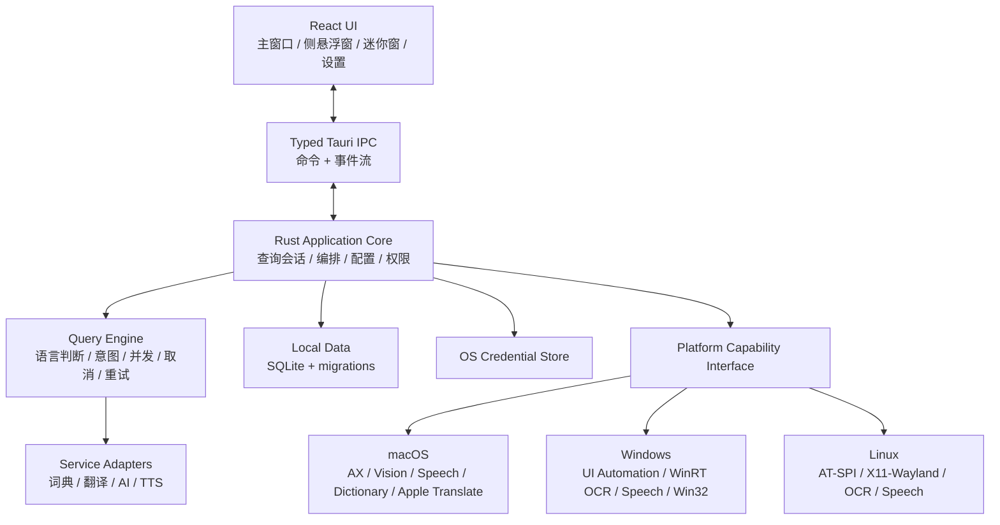

# Evolish 技术选型提案

> 状态：Accepted（基础栈已确认；其余专项决策按 ADR 继续）  
> 日期：2026-08-11  
> 目标平台：macOS、Windows、Linux 桌面端  
> 需求依据：[阶段一 PRD](../reference/pm/phase-1-prd.md)与[Easydict 功能对齐基线](../reference/pm/easydict-feature-baseline.md)

## 1. 结论

推荐采用以下主技术栈：

- **桌面容器：Tauri 2**
- **系统与业务核心：Rust**
- **界面：React + TypeScript + Vite**
- **持久化：SQLite，数据库只由 Rust 核心访问**
- **异步与网络：Tokio + Reqwest**
- **序列化与边界类型：Serde；由 Rust 类型生成前端 TypeScript 类型**
- **系统适配：macOS / Windows / Linux 独立平台模块**
- **敏感凭据：系统凭据库（macOS Keychain、Windows Credential Manager、Linux Secret Service）**
- **测试：Rust 单元/契约测试 + Vitest/React Testing Library + 平台集成测试**

该组合不是因为 Pot 使用了 Tauri，而是因为 Evolish 的核心工作发生在系统层和业务层：跨应用取词、截图、OCR、TTS、并行查询、凭据、SQLite 和未来学习数据。Rust 适合成为唯一可信核心，WebView 只承担高迭代速度的界面。

## 2. 选择标准

权重以阶段一 101 项功能基线为依据。

| 标准 | 权重 | 说明 |
|---|---:|---|
| 系统 API 与原生桥接 | 25% | 辅助功能、截图、OCR、TTS、词典、凭据库 |
| 多窗口与悬浮工具体验 | 20% | 迷你窗口、侧悬浮窗口、主窗口、多显示器 |
| 性能与常驻资源 | 15% | 长期驻留托盘、低延迟唤起、并行服务 |
| UI 与未来学习系统扩展 | 15% | 复杂设置、知识卡、复习和可视化 |
| 跨平台成熟度 | 10% | macOS、Windows、Linux 的构建与分发 |
| 单人长期维护成本 | 10% | 调试、类型安全、依赖和升级成本 |
| 安全与分发 | 5% | 权限隔离、签名、更新、密钥保护 |

## 3. 候选框架比较

评分范围为 1–5，分数代表对 Evolish 需求的适配度，不代表框架通用质量。

| 方案 | 系统集成 | 多窗口 | 资源占用 | UI 扩展 | 跨平台 | 可维护性 | 结论 |
|---|---:|---:|---:|---:|---:|---:|---|
| **Tauri 2 + Rust + React** | 4 | 4 | 5 | 5 | 4 | 4 | **推荐**；核心能力与 UI 边界最合适 |
| Qt 6 + C++/QML | 5 | 5 | 4 | 4 | 5 | 3 | 原生桌面能力最强，但单人长期维护与未来 Web 型学习 UI 成本较高 |
| Flutter Desktop | 3 | 3 | 3 | 5 | 4 | 4 | UI 一致性强，系统工具能力仍需三端插件和原生桥接 |
| Electron + React | 4 | 4 | 2 | 5 | 5 | 4 | 生态成熟，但常驻内存、包体和原生模块维护不符合本项目偏好 |
| Compose Multiplatform | 3 | 3 | 3 | 4 | 3 | 3 | 桌面 UI 可行，系统工具和 Linux 生态不是最稳妥选择 |

### 为什么不首选 Qt

Qt 对原生窗口和跨平台桌面最成熟，是唯一需要认真保留的替代方案。但 Evolish 后续将演进为内容密集、交互复杂的 AI 学习应用；React 生态在编辑器、虚拟列表、富文本、图表和可访问性组件上更丰富。Tauri 允许系统核心保持 Rust 原生，同时避免所有产品 UI 都由 C++/QML 维护。

### 为什么不首选 Electron

Electron 可以完成大多数外壳能力，也允许通过 Native Addons 访问操作系统 API。但它随应用分发 Chromium，常驻资源成本更高；跨应用取词、系统 OCR 和本地词典最终仍需原生代码。既然原生核心不可避免，直接以 Rust 为核心更清晰。

### 为什么不首选 Flutter

Flutter 官方支持 Windows、macOS 和 Linux，也支持自定义桌面插件及平台通道。问题不在“能不能做”，而在本项目大量能力位于平台 API：Flutter 层之外仍需维护 Swift/Objective-C、C++/WinRT 和 Linux 原生代码，而核心业务还需另行选择语言。Tauri 让 Rust 同时承担业务核心和大部分平台集成。

## 4. 推荐架构



### 分层职责

#### React UI

- 只负责呈现、用户输入、窗口内快捷键和短生命周期 UI 状态。
- 不直接访问数据库、文件系统、密钥或第三方翻译 API。
- 不持有服务密钥，不实现查询重试和结果合并规则。

#### Tauri IPC

- 使用明确的命令与事件，不向前端暴露通用 Shell 或任意文件访问能力。
- 每类窗口配置独立 capability，遵循最小权限原则。
- 长查询通过事件流推送单服务状态，避免等待所有服务完成才返回。

#### Rust Application Core

- 是查询会话、设置、数据库连接和服务生命周期的唯一所有者。
- 将所有入口规范化为 `QuerySession`。
- 负责取消过期请求、并发限制、超时、重试、脱敏日志和错误分类。

#### Platform Capability Interface

- 上层只依赖能力接口，不直接判断操作系统。
- 平台实现报告自身能力，例如是否支持 Apple Dictionary、选区坐标、特定 OCR 语言。
- 平台专属能力保持真实名称和来源，不使用功能不同的服务冒充。

## 5. 代码组织建议

第一阶段先保持一个 Rust 应用 crate，通过模块边界控制复杂度；只有出现独立发布、独立测试或编译隔离需求时再拆 crate。

```text
Evolish/
├── src/                         # React + TypeScript
│   ├── app/
│   ├── features/
│   ├── windows/
│   │   ├── main/
│   │   ├── floating/
│   │   └── mini/
│   ├── components/
│   └── bridge/                  # 生成的 IPC 类型与事件客户端
├── src-tauri/
│   ├── src/
│   │   ├── domain/              # 纯领域类型与规则
│   │   ├── application/         # 用例、查询编排、设置
│   │   ├── services/            # 翻译/词典/AI/TTS 适配器
│   │   ├── storage/             # SQLite 与迁移
│   │   ├── security/            # 凭据与脱敏
│   │   ├── platform/
│   │   │   ├── macos/
│   │   │   ├── windows/
│   │   │   └── linux/
│   │   └── ipc/                 # Tauri 命令与事件
│   └── migrations/
├── tests/
│   ├── contracts/               # 服务响应固定样本
│   └── platform/                # 真实桌面应用兼容测试说明/工具
└── docs/
```

## 6. 具体框架与库方向

### 前端

- React + TypeScript + Vite。
- Radix Primitives 提供可访问的交互基础，自建 Evolish 设计令牌与视觉组件。
- React reducer/context 管理窗口内 UI 状态；持久业务状态由 Rust 核心管理。只有出现可测量问题时，才通过 ADR 引入额外全局状态库。
- React Hook Form + Zod 用于复杂服务设置表单；最终边界校验仍由 Rust 执行。
- Vitest + React Testing Library 测试界面逻辑。

### Rust 核心

- Tokio：异步任务、取消、并发和超时。
- Reqwest：HTTP 客户端。
- Serde：服务协议和 IPC 类型。
- SQLx + SQLite：结构化本地数据和版本化迁移；不通过前端 SQL 插件直接开放数据库。
- Tracing：结构化日志与敏感字段脱敏。
- Thiserror：领域和基础设施错误类型。
- 使用 `keyring-core` 与明确的平台凭据 store 封装：密钥不进入 SQLite。

### UI 样式

- 使用 CSS Variables 建立设计令牌。
- 可使用 Tailwind 处理布局与状态样式，但组件 API 不与 Tailwind class 字符串绑定。
- 三类窗口共享组件和数据模型，布局按窗口角色组合，不复制三套业务实现。

## 7. 平台实现边界

### macOS

- Accessibility API（AXUIElement）读取选区和选区位置。
- Vision Framework 执行本地 OCR。
- AVSpeechSynthesizer / 系统语音接口提供 TTS。
- Apple Dictionary 与 Apple Translate 使用独立原生桥接。
- 使用 Keychain 保存凭据。
- 透明非激活面板、跨 Space 和焦点行为需要原生窗口扩展，不只依赖默认 WebView 窗口。

### Windows

- UI Automation 获取选区、文本范围和屏幕坐标。
- Windows Runtime OCR 或确定后的本地 OCR 引擎。
- Windows Speech API 提供系统 TTS。
- Win32 管理非激活悬浮窗、DPI、多显示器和焦点。
- Windows Credential Manager 保存凭据。

### Linux

- AT-SPI2 获取可访问文本与选区。
- X11 下实现完整选区定位和悬浮窗定位。
- Wayland 下遵循 compositor 与 portal 能力；不能假设存在全局坐标或任意窗口定位。
- OCR 引擎必须随应用确定并验证语言包，不能依赖用户手工安装未声明组件。
- Secret Service 保存凭据。

## 8. Linux Wayland 必须单独决策

“选中文本后在选区旁显示查询图标/迷你窗口”依赖全局选区坐标和应用主动定位窗口。Wayland 的安全模型通常禁止客户端读取全局坐标或任意移动窗口；Electron 官方文档也明确记录了 Wayland 下不能程序化定位、移动和读取全局窗口坐标。该限制来自桌面协议，不会因为选择 Tauri、Flutter、Electron 或 Qt 而消失。

因此需要在产品层明确：

- Linux X11 可以要求完整功能对齐。
- Linux Wayland 必须建立按桌面环境和协议能力的兼容矩阵。
- 如果要求 Wayland 与 macOS 完全相同的选区旁定位，需逐个 compositor 研究专属协议，仍无法保证通用实现。

这不是延后实现的理由，而是必须在技术基线阶段写清楚的操作系统边界。

## 9. 服务适配器设计

阶段一使用编译期内置适配器，不先建设第三方动态插件市场。所有翻译服务实现统一能力接口：

```text
ServiceAdapter
├── metadata()          名称、认证方式、支持语言、结果类型
├── validate_config()   本地配置校验
├── health_check()      用户主动触发的连接测试
├── query(request)      可取消的流式/一次性查询
└── normalize(result)   映射统一结果，同时保留服务特有字段
```

这样能够替换服务而不影响 UI，也避免在需求尚未稳定时引入动态代码加载和插件安全问题。

## 10. 数据与安全决策

- SQLite 开启 WAL，所有 schema 变更通过迁移文件执行。
- 查询原文、OCR 文本和来源上下文分别定义隐私开关与保留策略。
- API Key、Token、Cookie 和自定义服务密钥只进入系统凭据库。
- 日志默认不记录完整查询文本、密钥、Cookie 或服务原始响应。
- UI WebView 使用严格 CSP；远程内容不在拥有系统权限的 WebView 中直接加载。
- Tauri capability 按窗口拆分：迷你窗口没有设置、密钥或任意文件权限。

## 11. 构建与验证

- GitHub Actions 建立 macOS、Windows、Linux 构建矩阵。
- Rust：领域测试、服务契约测试、数据库迁移测试、取消/并发测试。
- React：组件行为、键盘导航和窗口布局测试。
- 平台：真实浏览器、Office/PDF、编辑器和聊天软件的取词集成测试。
- 发布前完成 macOS 签名与 notarization、Windows code signing、Linux 包格式与更新验证。
- 自动更新采用签名元数据，客户端拒绝未签名或来源不匹配的更新。

## 12. 已接受的决策

| 决策 | 提案 | 状态 |
|---|---|---|
| 桌面框架 | Tauri 2 | 已确认 |
| 核心语言 | Rust | 已确认 |
| UI | React + TypeScript + Vite | 已确认 |
| 数据库 | SQLite，由 Rust 独占访问 | 已确认 |
| 平台策略 | macOS → Windows → Linux；三端使用原生适配层 | 已确认 |
| Linux 完整对齐 | X11 完整；Wayland 建立能力矩阵，不虚假宣称同等能力 | 已确认 |
| Provider 扩展 | 阶段一使用编译期内置适配器，不支持动态插件 | 已确认 |
| UI 国际化 | `zh-CN`、`en-US`，类型安全并预留 RTL | 已确认 |
| 公开分发 | 公共仓库与公开二进制；签名、更新和回滚在发布前验收 | 已确认 |
| 许可证 | Apache-2.0；不复制 Easydict/Pot 的 GPL 实现代码 | 已确认 |

## 13. 依据

- [Tauri 架构](https://v2.tauri.app/concept/architecture/)
- [Tauri 进程模型](https://v2.tauri.app/concept/process-model/)
- [Tauri Global Shortcut](https://v2.tauri.app/plugin/global-shortcut/)
- [Tauri Deep Linking](https://v2.tauri.app/plugin/deep-linking/)
- [Tauri System Tray](https://v2.tauri.app/learn/system-tray/)
- [Tauri Window Customization](https://v2.tauri.app/learn/window-customization/)
- [Flutter Desktop](https://docs.flutter.dev/platform-integration/desktop)
- [Flutter Platform Channels](https://docs.flutter.dev/platform-integration/platform-channels)
- [Electron BrowserWindow](https://www.electronjs.org/docs/latest/api/browser-window)
- [Electron Native Code](https://www.electronjs.org/docs/latest/tutorial/native-code-and-electron)
- [Qt QSystemTrayIcon](https://doc.qt.io/qt-6/qsystemtrayicon.html)
