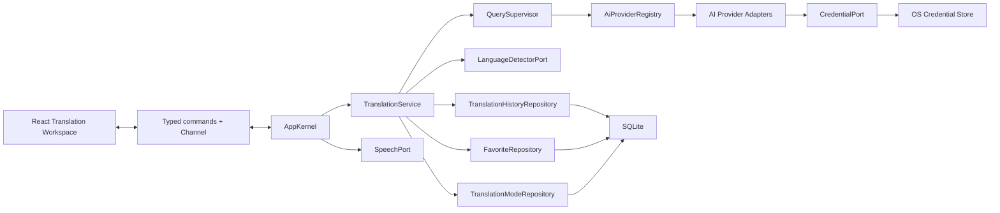
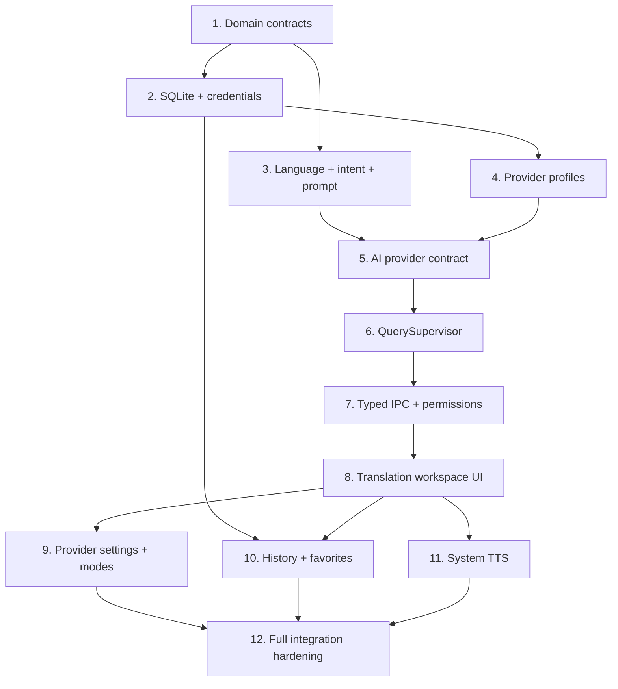

# 文本输入翻译详细技术设计

> 状态：Accepted
> 日期：2026-08-12
> 接受日期：2026-08-12
> 决策者：项目所有者
> 产品依据：[文本输入翻译 PRD](../reference/pm/text-input-translation-prd.md)
> 架构依据：[总体架构](./overall-architecture.md)、[ADR-0005](./adr/0005-ai-only-translation-and-on-demand-query.md)、[ADR-0006](./adr/0006-two-window-product-model.md)

## 1. 设计目标

本设计覆盖文本输入翻译从输入、语言判断、AI 调用、完整结果解析、历史、收藏到系统 TTS 的完整工程实现。它不是临时演示方案；模块、数据模型、错误、权限和迁移均按 Phase 1 正式产品边界设计，并允许后续划词、OCR、迷你窗口和学习系统复用。

必须满足：

1. Rust 是查询、Provider、SQLite、凭据、取消和版本状态的唯一可信核心。
2. React 只持有当前视图状态，通过类型化最小权限 IPC 调用用例。
3. 一次提交只请求主 AI；其他 AI 仅在用户展开时请求；没有隐式回退。
4. AI 正文只在完整响应解析和校验后进入 UI。
5. 每次查询和重试都有稳定 ID，迟到响应无法污染当前会话。
6. 成功查询默认写入本地历史；隐私模式不写；收藏引用稳定结果版本。
7. 同一核心能够被主窗口与迷你窗口复用；OCR 与所有划词入口进入迷你窗口，不引入第三类结果窗口。

## 2. 技术决策摘要

| 领域 | 决策 |
|---|---|
| 运行时 | 单一 Tauri 2 Rust 核心，通过 `State<AppKernel>` 注入应用服务 |
| IPC | 短操作使用 async command；查询状态使用调用方提供的 Tauri `Channel<TranslationEventDto>` |
| IPC 契约 | Rust `serde` + `ts-rs` 生成 TypeScript；CI 检查生成文件漂移 |
| 权限 | 每个 command 进入 `tauri-build` manifest 并生成 allow/deny permission；只授权 `main` 窗口 |
| 异步 | Tokio 任务；`tokio-util::CancellationToken` 管理 session 和 attempt 取消 |
| HTTP | Rust `reqwest` 统一网络层；Provider adapter 不使用前端 SDK |
| AI 协议 | OpenAI、Anthropic、Gemini 原生 adapter；OpenAI-compatible 通用 adapter |
| 结构化结果 | 内部版本化 schema；Provider 原生结构输出能力 + 严格反序列化与语义校验 |
| 长文本 | 按自然段和模型预算确定性分段；受控并发；全部成功后原序合并并一次发布 |
| 语言识别 | `LanguageDetectorPort`；Rust 本地实现使用 Lingua 的 Phase 1 语言子集与规则层 |
| 数据库 | SQLx + SQLite WAL + 版本化 migration；Rust repository 独占访问 |
| 凭据 | `CredentialPort` 封装平台凭据库；SQLite 只保存 `secret_ref` |
| 前端状态 | feature-local React reducer；服务端事实以 Rust snapshot/event 为准 |
| UI 表单 | 受控表单；Provider 设置使用 React Hook Form，最终校验在 Rust |
| TTS | `SpeechPort` 调用平台系统 TTS，不接入传统翻译或在线 TTS 作为本功能依赖 |
| 剪贴板 | Rust 初始化 Tauri 2 官方 clipboard-manager plugin，由自有 `clipboard_write_text` command 调用；WebView 不直接获得插件权限 |

## 3. 系统组件



### 3.1 `AppKernel`

`AppKernel` 在 Tauri setup 阶段构造并通过 `.manage()` 注册，持有长生命周期服务：

```rust
pub struct AppKernel {
    pub translations: Arc<TranslationService>,
    pub providers: Arc<AiProviderRegistry>,
    pub history: Arc<dyn TranslationHistoryRepository>,
    pub favorites: Arc<dyn FavoriteRepository>,
    pub modes: Arc<dyn TranslationModeRepository>,
    pub credentials: Arc<dyn CredentialPort>,
    pub speech: Arc<dyn SpeechPort>,
}
```

Tauri command 只做 DTO 转换、窗口权限上下文传递和 use case 调用，不直接发 HTTP、执行 SQL 或读取凭据。

### 3.2 查询服务职责

`TranslationService`：

- 校验输入和用户设置；
- 规范化文本但保留语义字符与布局；
- 调用本地语言检测和内容类型分类；
- 解析自动/手动语言方向；
- 固化 provider、model、mode 和 schema 快照；
- 建立 `TranslationSession`；
- 委托 `QuerySupervisor` 执行 attempt；
- 在成功后按隐私策略事务性写历史；
- 向 Channel 发布稳定 DTO。

`QuerySupervisor`：

- 保存每个窗口槽位的 active session；
- 为 session 和 attempt 建立取消 token；
- 只启动主服务 attempt；
- 响应按需展开和指定服务重试；
- 管理超时、并发与长文本子任务；
- 使用 session ID、attempt ID、window generation 三重隔离；
- 只在完整结果校验成功后发布 `AttemptSucceeded`。

## 4. Rust 模块与文件结构

```text
src-tauri/src/
├── domain/
│   ├── mod.rs
│   ├── error.rs
│   ├── language.rs
│   ├── query_intent.rs
│   ├── translation.rs
│   ├── translation_mode.rs
│   └── provider.rs
├── application/
│   ├── mod.rs
│   ├── bootstrap.rs
│   └── translation/
│       ├── mod.rs
│       ├── ports.rs
│       ├── service.rs
│       ├── supervisor.rs
│       ├── language_direction.rs
│       ├── classifier.rs
│       ├── chunker.rs
│       └── result_validator.rs
├── infrastructure/
│   ├── mod.rs
│   ├── ai/
│   │   ├── mod.rs
│   │   ├── registry.rs
│   │   ├── http_client.rs
│   │   ├── openai.rs
│   │   ├── anthropic.rs
│   │   ├── gemini.rs
│   │   ├── openai_compatible.rs
│   │   └── contract_fixtures.rs
│   ├── language/
│   │   ├── mod.rs
│   │   └── lingua_detector.rs
│   ├── storage/
│   │   ├── mod.rs
│   │   ├── database.rs
│   │   ├── migrations.rs
│   │   ├── provider_profiles.rs
│   │   ├── translation_modes.rs
│   │   ├── translation_history.rs
│   │   └── favorites.rs
│   ├── credentials/
│   │   ├── mod.rs
│   │   └── system_store.rs
│   └── speech/
│       ├── mod.rs
│       └── system_speech.rs
├── ipc/
│   ├── mod.rs
│   ├── translation.rs
│   ├── provider_settings.rs
│   ├── history.rs
│   ├── favorites.rs
│   ├── speech.rs
│   └── dto/
│       ├── mod.rs
│       ├── translation.rs
│       ├── provider.rs
│       ├── history.rs
│       └── favorite.rs
└── lib.rs

src-tauri/migrations/
├── 0001_translation_core.sql
├── 0002_translation_history.sql
└── 0003_translation_favorites.sql
```

文件按领域职责拆分。单个 Provider adapter 只处理该协议的请求、响应、错误与 capability 映射；共享重试、取消、历史和产品规则不能进入 adapter。

## 5. 领域模型

### 5.1 标识和值对象

所有持久化标识使用 UUID v7 字符串，生成于 Rust：

```rust
pub struct TranslationSessionId(Uuid);
pub struct TranslationAttemptId(Uuid);
pub struct ProviderProfileId(Uuid);
pub struct TranslationModeId(Uuid);
pub struct ResultVersion(u32);
```

核心输入：

```rust
pub struct TranslationInput {
    pub original_text: String,
    pub normalized_text: String,
    pub source_language: LanguageSelection,
    pub target_language: Language,
    pub intent: QueryIntent,
    pub mode_snapshot: TranslationModeSnapshot,
    pub entry_point: QueryEntryPoint,
    pub privacy: PrivacyMode,
}
```

### 5.2 内容类型

```rust
pub enum QueryIntent {
    Word,
    Phrase,
    Sentence,
    LongText,
}
```

分类是确定性本地规则：Unicode 分词数量、句末标点、换行/段落数、字符长度和语言特性共同决定。分类器给出 `intent + confidence + reasons`，用户覆盖优先，并进入 session 快照。

### 5.3 自适应结果

```rust
pub enum AdaptiveTranslationResult {
    Word(WordResultV1),
    Phrase(PhraseResultV1),
    Sentence(SentenceResultV1),
    LongText(LongTextResultV1),
}
```

- `WordResultV1`：主要译义、词性条目、IPA/读音、词形、搭配、双语例句。
- `PhraseResultV1`：整体含义、适用语境、自然译法、双语例句。
- `SentenceResultV1`：主要译文、必要的用词说明与语法说明。
- `LongTextResultV1`：有序段落，每段保存 source index、source text 和 translated text。

所有可选字段为空时省略。校验器禁止空主要译文、重复段落 index、丢失分段、超出 enum 的词性值和语言方向不一致。

### 5.4 状态机

```rust
pub enum AttemptStatus {
    NotRequested,
    Queued,
    Running,
    Succeeded,
    Failed,
    Cancelled,
}
```

合法转换由领域函数封装：

```text
NotRequested → Queued → Running → Succeeded
                              ├→ Failed
                              └→ Cancelled
Queued → Cancelled
Failed → Queued（新 attempt，不复用旧 ID）
Succeeded → Queued（显式重新生成，新 attempt）
```

状态不能原地从 `Failed` 改为 `Succeeded`；重试永远是新 attempt。

## 6. 语言识别与方向解析

### 6.1 处理顺序

1. 拒绝空白和仅控制字符。
2. 规范化换行符为 `\n`，移除无语义的首尾空白；不进行会改变含义的 Unicode compatibility normalization。
3. 运行脚本规则，对汉字、假名、谚文、西里尔等高置信脚本先分类。
4. 运行 Lingua Phase 1 语言模型子集。
5. 混合脚本或置信度低于阈值时返回 `Uncertain`，不伪装确定。
6. 应用手动语言覆盖。
7. 自动方向规则：源语言等于主要目标语言时选次要目标语言，否则选主要目标语言。
8. 源/目标相同或 Provider 不支持时在网络请求前失败。

### 6.2 48 种语言目录

`Language` 是项目内部封闭 enum，包含统一 BCP 47 tag、ISO 639 映射、显示 key、书写方向和 Provider 映射。Provider adapter 只能从该目录转换，不能自行定义散落字符串。语言目录使用固定 fixture 验证双向映射和不可支持状态。

## 7. 翻译模式与提示词编译

提示词分三层，顺序固定：

1. **System contract**：安全边界、目标语言、结果 schema、禁止编造占位、完整输出要求；用户不可编辑。
2. **Mode instruction**：标准、直译、自然、学术、简洁或用户模板的风格说明。
3. **User content**：以 Provider 协议支持的结构化字段传入，不通过字符串拼接伪装系统指令。

`PromptCompiler` 输入 mode snapshot、语言方向、intent 和 schema version，输出不可变的 `CompiledPrompt`。历史保存模板 ID、模板版本、非秘密配置快照和编译器 schema 版本，不保存 API Key。

内置模板以 Rust seed/migration 注册，拥有稳定 ID；修改内置模板会复制为自定义模板。自定义模板保存前执行长度、非法控制字符和保留占位符校验。

## 8. Provider 架构

### 8.1 Port

```rust
#[async_trait]
pub trait AiTranslationProvider: Send + Sync {
    fn descriptor(&self) -> &ProviderDescriptor;
    async fn translate(
        &self,
        request: ProviderTranslationRequest,
        cancellation: CancellationToken,
    ) -> Result<AdaptiveTranslationResult, ProviderError>;
}
```

`ProviderTranslationRequest` 只包含本次请求需要的文本、语言、intent、compiled prompt、schema、timeout 和非秘密参数。adapter 通过 `secret_ref` 向 `CredentialPort` 获取密钥，密钥不进入 IPC DTO 或持久化请求快照。

### 8.2 Registry 与 profile

- `ProviderDescriptor` 描述协议类型、结构输出能力、上下文限制、支持语言和配置字段。
- `ProviderProfile` 是用户实例：显示名、adapter kind、endpoint、model、timeout、参数、secret_ref、enabled、sort_order。
- `TranslationWorkspaceProfile` 保存窗口角色、可空的 `primary_provider_profile_id`、有序 enabled provider IDs、主要/次要目标语言、默认 mode ID 和乐观锁 version。
- fresh install 允许 `primary_provider_profile_id = NULL` 和空 enabled 顺序，使应用可启动并进入正式配置状态；`translation_start` 在请求前返回 `translation.provider.primary_missing`，绝不构造虚假 provider 或 fallback。
- 首个 provider profile 与 workspace 主服务设置通过一个 application use case 原子提交。进入 configured 状态后，repository 校验保证主服务已启用、只出现一次且存在于 enabled 顺序中，主要/次要目标语言不同，默认 mode 可用。
- 查询创建时在一个一致性读取中加载 workspace profile 及关联对象，并固化 `WorkspaceProfileSnapshot`；之后的设置修改不改变已建立 session。
- Registry 在请求前验证 profile、凭据、URL、模型能力和语言能力。
- 自定义 endpoint 默认只允许 HTTPS；`localhost`、`127.0.0.1`、`::1` 可显式使用 HTTP。

### 8.3 原生 adapter

每个 adapter 独立负责：

- 构造官方协议请求；
- 使用官方结构化输出或工具 schema 能力；
- 将 HTTP、认证、限额、模型、安全拒绝和格式错误映射为统一 `ProviderErrorKind`；
- 读取完整响应体后严格解析；
- 不记录 Authorization、API Key、完整正文或原始敏感响应。

OpenAI-compatible adapter 只承诺兼容项目明确支持的 request/response 子集；连接测试必须实际验证模型与结构化输出，不以“HTTP 200”代替能力验证。

### 8.4 HTTP 安全

- 共享 `reqwest::Client`，设连接、整体请求和响应体大小限制。
- 禁止自动向不同 origin 转发 Authorization header。
- 自定义 URL 解析后拒绝 userinfo、fragment 和非 HTTP(S) scheme。
- 日志只记录 provider profile ID、model、status、latency、错误分类和 session/attempt ID。
- 代理配置由未来统一网络设置提供，adapter 不读取环境中的任意秘密。

## 9. 长文本处理

`TextChunker` 使用 Provider descriptor 的上下文预算和保守 token estimator：

1. 先按空行形成段落。
2. 单段过长时按句子边界拆分。
3. 单句仍超限时按 Unicode grapheme 安全边界拆分，并记录 continuation。
4. 每块带连续 index、源字符范围和原始段落 ID。
5. 子任务并发上限默认为 2，并受 Provider profile 限速器控制。
6. 任一块失败则整个 attempt 失败；不展示或保存部分译文。
7. 全部成功后按 index 合并，验证无缺失、无重复，再发布完整结果。

取消 session 会取消所有子任务。重试创建新 attempt，可以复用当前 session 输入快照，但不能把旧 attempt 的部分结果拼入新 attempt。

## 10. IPC 设计

### 10.1 Commands

| Command | 输入 | 输出/Channel | 权限 |
|---|---|---|---|
| `translation_get_workspace` | 无 | 当前设置、可选语言、模式、Provider 摘要 | main only |
| `translation_update_workspace` | 主服务、服务顺序、主要/次要语言、默认模式、expected version | 新 workspace profile | main only |
| `translation_start` | `StartTranslationDto` + Channel | `StartTranslationResponseDto` + 状态/完整结果事件 | main only |
| `translation_cancel` | session ID | acknowledgement | main only |
| `translation_detach_window` | window generation | acknowledgement | main only |
| `translation_request_provider` | session ID + provider profile ID + Channel | attempt ID + 事件 | main only |
| `translation_retry_attempt` | attempt ID + Channel | 新 attempt ID + 事件 | main only |
| `provider_list_profiles` | 无 | 脱敏 profile 列表 | main only |
| `provider_save_profile` | 非秘密配置 DTO | profile | main only |
| `provider_set_secret` | profile ID + secret | acknowledgement，不回显 secret | main only |
| `provider_test_profile` | profile ID | capability test result | main only |
| `translation_mode_list/save/delete/reorder` | mode DTO | mode snapshot/list | main only |
| `history_search/get/delete/clear/update_policy` | query DTO | paged summary/detail | main only |
| `favorite_set/search` | stable result reference/query | state/page | main only |
| `speech_play/stop` | text + language | playback state | main only |
| `clipboard_write_text` | text + content kind | acknowledgement | main only |

本设计当前实现手动文本输入，因此这些 command 只加入 `main` capability。clipboard-manager plugin 在 Rust 中初始化，但前端不直接调用其 JS API；复制必须经过自有 command 的输入上限和内容类型校验。后续 Mini 复用查询核心时建立独立最小 capability，不能继承 Main 的设置、凭据或历史清理权限；产品不得创建 Floating 或独立 Settings capability。

### 10.2 Events

```rust
pub enum TranslationEventDto {
    SessionPrepared { session: TranslationSessionDto },
    AttemptQueued { attempt: TranslationAttemptSummaryDto },
    AttemptRunning { attempt_id: String },
    AttemptSucceeded { attempt: TranslationAttemptDto },
    AttemptFailed { attempt_id: String, error: AppErrorDto },
    AttemptCancelled { attempt_id: String },
    SessionCompleted { session_id: String },
}
```

不定义 `TokenReceived` 或 `PartialText`。完整结果 DTO 包含 `schemaVersion` 和 discriminated union `kind`，由 `ts-rs` 生成 TypeScript。

### 10.3 顺序与幂等

- 每个 command 调用拥有独立 Channel。
- 同一 attempt 的事件序号单调递增；UI reducer 忽略小于等于最后序号的重复事件。
- `translation_start` 接收前端生成的 `submission_id`，Rust 在短时间窗口内去重双击/重复键盘事件。
- Rust 返回的 session/attempt ID 是事实来源，前端临时 ID 只用于提交按钮防抖和关联。

## 11. SQLite 设计

### 11.1 表

```text
provider_profiles
- id TEXT PK
- adapter_kind TEXT NOT NULL
- display_name TEXT NOT NULL
- endpoint TEXT NULL
- model TEXT NOT NULL
- parameters_json TEXT NOT NULL
- secret_ref TEXT NULL
- enabled INTEGER NOT NULL
- sort_order INTEGER NOT NULL
- created_at / updated_at TEXT NOT NULL

translation_workspace_profiles
- id TEXT PK
- window_role TEXT NOT NULL UNIQUE  # CHECK window_role IN ('main', 'mini')
- primary_provider_profile_id TEXT NULL FK
- enabled_provider_order_json TEXT NOT NULL
- primary_target_language TEXT NOT NULL
- secondary_target_language TEXT NOT NULL
- default_mode_id TEXT NOT NULL FK
- version INTEGER NOT NULL
- created_at / updated_at TEXT NOT NULL

translation_modes
- id TEXT PK
- kind TEXT NOT NULL               # built_in | custom
- name TEXT NOT NULL
- instruction TEXT NOT NULL
- version INTEGER NOT NULL
- enabled INTEGER NOT NULL
- sort_order INTEGER NOT NULL
- created_at / updated_at TEXT NOT NULL

translation_sessions
- id TEXT PK
- original_text TEXT NOT NULL
- normalized_text TEXT NOT NULL
- source_language TEXT NULL
- source_language_confidence REAL NULL
- target_language TEXT NOT NULL
- intent TEXT NOT NULL
- entry_point TEXT NOT NULL
- mode_id TEXT NOT NULL
- mode_version INTEGER NOT NULL
- mode_snapshot_json TEXT NOT NULL
- privacy_mode TEXT NOT NULL
- workspace_snapshot_version INTEGER NOT NULL
- workspace_snapshot_json TEXT NOT NULL
- created_at TEXT NOT NULL

translation_attempts
- id TEXT PK
- session_id TEXT NOT NULL FK
- provider_profile_id TEXT NOT NULL
- provider_snapshot_json TEXT NOT NULL
- request_snapshot_version INTEGER NOT NULL
- request_snapshot_json TEXT NOT NULL  # text hash/正文按历史策略、语言、intent、mode、provider、model、parameters
- result_version INTEGER NOT NULL
- status TEXT NOT NULL
- error_code TEXT NULL
- started_at / completed_at TEXT NULL
- UNIQUE(session_id, provider_profile_id, result_version)

translation_results
- attempt_id TEXT PK FK
- schema_version INTEGER NOT NULL
- result_kind TEXT NOT NULL
- primary_translation TEXT NOT NULL
- result_json TEXT NOT NULL
- created_at TEXT NOT NULL

favorite_references
- id TEXT PK
- session_id TEXT NOT NULL FK
- attempt_id TEXT NOT NULL UNIQUE FK
- created_at TEXT NOT NULL

history_search
- SQLite FTS5 external-content index for original_text and primary_translation

history_policy
- singleton_id INTEGER PK CHECK(singleton_id = 1)
- enabled INTEGER NOT NULL
- retention_days INTEGER NULL
```

### 11.2 事务规则

- 成功 attempt 的 status、result 和 FTS 更新在一个事务中提交。
- session 只在允许历史写入时持久化；隐私模式使用内存 session store，完成后立即释放。
- 自动历史关闭时，查询先保存在内存；用户收藏时以一个事务写入最小 session、attempt、result 和 favorite。
- 清空历史只删除未收藏 session；删除收藏记录必须明确确认并在事务中删除 favorite 与关联内容。
- retention cleanup 在数据库启动完成后执行一次，在保留策略更新提交后立即执行一次，并由 AppKernel 的单实例有界后台任务每 24 小时执行；只删除到期且未收藏的 session。
- cleanup 失败发布脱敏可诊断 warning，不阻止应用启动，不修改 policy，也不得删除收藏。
- history 保存失败不撤销已经展示的成功结果，但发布独立可诊断 storage warning。
- 持久化 session 保存版本化 workspace snapshot；每个 attempt 保存版本化完整 request/configuration snapshot。允许保存历史时正文随 session 持久化；关闭历史/隐私模式时快照只存在内存，收藏时才事务性写入最小必要快照。
- 重启后版本切换和 `ConfigurationDiffDto` 从持久化 snapshots 重建，不依赖当前 workspace/provider/mode 设置。

## 12. 错误模型

领域错误按稳定 code 分类：

```text
translation.input.empty
translation.input.too_large
translation.language.uncertain
translation.language.unsupported_pair
translation.provider.primary_missing
translation.provider.disabled
translation.provider.auth
translation.provider.rate_limited
translation.provider.quota
translation.provider.model_unavailable
translation.provider.safety_refusal
translation.provider.invalid_response
translation.provider.timeout
translation.provider.network
translation.cancelled
translation.storage.write_failed
translation.favorite.conflict
translation.speech.unsupported_language
```

`AppErrorDto` 继续只公开 code、message key、retryable、suggested action、source 和脱敏 detail。Provider 原始 body、请求正文、密钥和堆栈不进入 DTO。

## 13. React 前端设计

### 13.1 文件结构

```text
src/
├── bridge/
│   ├── translation.ts
│   ├── providers.ts
│   ├── history.ts
│   ├── favorites.ts
│   ├── speech.ts
│   └── generated/
├── features/translation/
│   ├── TranslationWorkspace.tsx
│   ├── translationReducer.ts
│   ├── useTranslationSession.ts
│   ├── components/
│   │   ├── TranslationInput.tsx
│   │   ├── LanguageDirectionControl.tsx
│   │   ├── TranslationModeSelect.tsx
│   │   ├── ProviderResultList.tsx
│   │   ├── ProviderResultCard.tsx
│   │   ├── AdaptiveResult.tsx
│   │   ├── WordResult.tsx
│   │   ├── PhraseResult.tsx
│   │   ├── SentenceResult.tsx
│   │   └── LongTextResult.tsx
│   └── __tests__/
├── features/provider-settings/
├── features/translation-modes/
├── features/history/
├── features/favorites/
└── features/speech/
```

### 13.2 Reducer 状态

```ts
type TranslationWorkspaceState = {
  draft: TranslationDraft;
  activeSessionId: string | null;
  activeSubmissionId: string | null;
  session: TranslationSessionDto | null;
  attemptsByProvider: Record<string, TranslationAttemptView>;
  providerOrder: string[];
  selectedAttemptByProvider: Record<string, string>;
  isSubmitting: boolean;
  workspaceError: AppErrorDto | null;
  persistenceWarning: AppErrorDto | null;
};
```

Reducer 只接受有类型的用户 action 和 Channel event。事件的 session/attempt 不属于当前状态时被忽略。组件不得各自维护重复的 attempt status。

### 13.3 交互规则

- `Enter` 仅在非组合态且没有 `Shift` 时提交；按钮走同一 `submit()`。
- 生成时允许编辑草稿；再次提交会先取消旧 session 再创建新 session。
- 主服务卡默认展开；其他卡初始 `NotRequested`，首次展开调用 `translation_request_provider`。
- 再次折叠/展开已成功卡片不请求；显式重试才产生新 attempt。
- 生成期间只显示状态、取消按钮和服务/模型信息，不显示正文占位 token。
- 重试时旧成功结果保持可见，卡片显示“正在生成新版本”。
- 重试 command 返回新 attempt 的 input/language/mode/provider/model snapshot 及相对旧 attempt 的 `ConfigurationDiffDto`；卡片和版本切换器显示发生变化的配置项。
- 收藏绑定当前显示的 attempt ID；切换版本后收藏状态随版本变化。
- 历史和收藏使用分页查询，不把完整数据库加载到 WebView。

## 14. 隐私与安全边界

1. 用户按提交或展开前，不向任何 AI endpoint 发送正文。
2. Provider 设置页面永不回显已保存密钥，只显示 `configured: true/false`。
3. `provider_set_secret` 的输入只在 command 调用内存在，写入凭据库后立即释放；Debug 实现不得包含 secret。
4. SQLite、日志、崩溃报告、诊断包、测试快照和 TypeScript state 不含密钥。
5. 默认日志不含正文；测试使用人工 fixture，不记录真实用户请求。
6. 隐私模式 session、attempt 和 result 只存在内存，应用退出或完成后释放。
7. 自定义 endpoint 在保存和请求时双重校验，防止配置迁移绕过新规则。
8. Tauri capability 只允许 `main` 调用本功能命令；未来窗口按最小集合重新授权。
9. WebView 不获得通用剪贴板插件权限；只能调用受约束的 `clipboard_write_text`。

### 14.1 窗口生命周期

- 主窗口隐藏或销毁、React workspace 卸载、应用退出均调用统一的窗口 detach/取消 use case。
- Rust 监听 Tauri window event 作为最终保障；即使 WebView 没有成功发送卸载命令，也取消该 window generation 的 active session。
- 关闭后的迟到响应被 generation guard 丢弃，不得发布到新窗口、写入成功历史或改变收藏状态。
- `AppKernel` 持有 retention scheduler 的唯一 task handle 和 cancellation token；Tauri setup 只启动一个周期任务，应用退出时有界取消并等待，不允许重复初始化创建多个清理任务。

## 15. 测试策略

### 15.1 Rust

- `domain`：状态转换、语言方向、intent 分类、schema 语义校验的单元/属性测试。
- `application`：fake detector/provider/repository/credential/speech 的用例测试。
- `query`：主服务唯一请求、按需请求、双提交去重、取消、超时、迟到隔离、长文本顺序与全有或全无。
- `providers`：每个协议使用脱敏固定 request/response fixture 做契约测试；禁止真实付费 API 作为 CI 条件。
- `storage`：临时 SQLite migration、事务、FTS、retention、history off、privacy、favorite 引用测试。
- `security`：secret 不可序列化、URL 校验、日志脱敏和诊断 DTO 测试。

### 15.2 React

- reducer 事件序列和过期事件忽略。
- IME `compositionstart/compositionend`、Enter、Shift+Enter 和按钮等价性。
- `NotRequested` 卡展开一次只调用一次。
- 完整结果前不渲染正文；成功后自适应组件选择正确。
- 重试保留旧版本，切换版本和收藏绑定正确。
- 历史搜索、删除确认、隐私模式和错误恢复的组件测试。
- 键盘导航、焦点、ARIA live 状态和无障碍名称测试。

### 15.3 集成与平台

- 使用本地 mock HTTP server 验证四类 adapter 的请求、取消、超时、非法响应和重定向安全。
- Tauri command permission 测试证明未授权窗口无法调用。
- macOS → Windows → Linux 依次进行系统凭据库、系统 TTS、IME、剪贴板和窗口关闭测试。
- CI 每次运行 Rust fmt/clippy/test、生成 DTO 漂移、前端 lint/test/typecheck/build、三端 Tauri build 和供应链检查。

## 16. 可观测性

每次操作使用结构化 span：

```text
translation.session        session_id, window_label, entry_point, intent
translation.attempt        attempt_id, provider_profile_id, model, result_version
translation.chunk          attempt_id, chunk_index, chunk_count
translation.persistence    session_id, operation, outcome
```

允许记录：ID、枚举、字符数、chunk 数、耗时、HTTP status、错误 code。

禁止记录：原文、译文、提示词正文、Authorization、API Key、Provider 原始响应、来源窗口标题。

## 17. 性能与资源预算

- 提交到本地 `SessionPrepared` P95 ≤ 100ms，不含首次数据库 migration。
- 完整 Provider 响应到 UI 完整结果 P95 ≤ 100ms。
- 语言 detector 在应用启动后惰性初始化一次，模型集合固定，禁止每查询重复加载。
- SQLite 使用单连接写队列和有界读连接池；WebView 不持有数据库游标。
- 搜索结果分页默认 50 条，上限 100 条。
- AI 响应体、输入字符数、chunk 数和并发均有明确上限；超限返回错误，不无限分配内存。

## 18. 实施顺序与依赖



每一步必须提供可运行测试和独立提交；不允许在 UI 中伪造 Provider 或历史结果来宣称闭环完成。

## 19. 完成判定

技术设计完成实现的条件是：

- PRD 的所有 `TIT-*`、`EVO-AI-*`、`EVO-HIS-*`、`EVO-FAV-*` 均链接到测试或平台证据；
- 四类 AI adapter 共同契约通过，未展开服务请求数为零；
- 完整结果前 UI 无正文，迟到结果污染测试为零；
- 历史、隐私、保留、收藏和 migration 事务测试通过；
- API Key 泄漏扫描覆盖 SQLite、IPC、日志和诊断包；
- macOS、Windows、Linux 的目标平台矩阵和 CI 全部通过；
- 文档、生成 DTO、permissions 和实现不存在漂移。

## 20. 已接受的技术决策

项目所有者于 2026-08-12 确认本详细技术设计及以下全部实施决策：

1. 使用 Lingua 的 Phase 1 语言子集作为本地 detector 实现。
2. Provider 直接使用 Rust HTTP adapter，不引入各厂商 SDK。
3. 历史搜索采用 SQLite FTS5。
4. UUID v7 作为 session、attempt、profile、mode 和 favorite 的稳定 ID。
5. 长文本子任务默认并发上限为 2，失败采用全有或全无结果。
6. Linux 系统 TTS 使用 Rust `tts` adapter 的 Speech Dispatcher backend；Speech Dispatcher 是明确运行时依赖，缺失时返回可执行的 unavailable 错误，不自动切换到命令行或在线 TTS。

这些决策均为正式实现约束。后续如需变更，必须通过新的 ADR 或对本设计进行显式修订，不得在编码阶段以临时实现替代。
