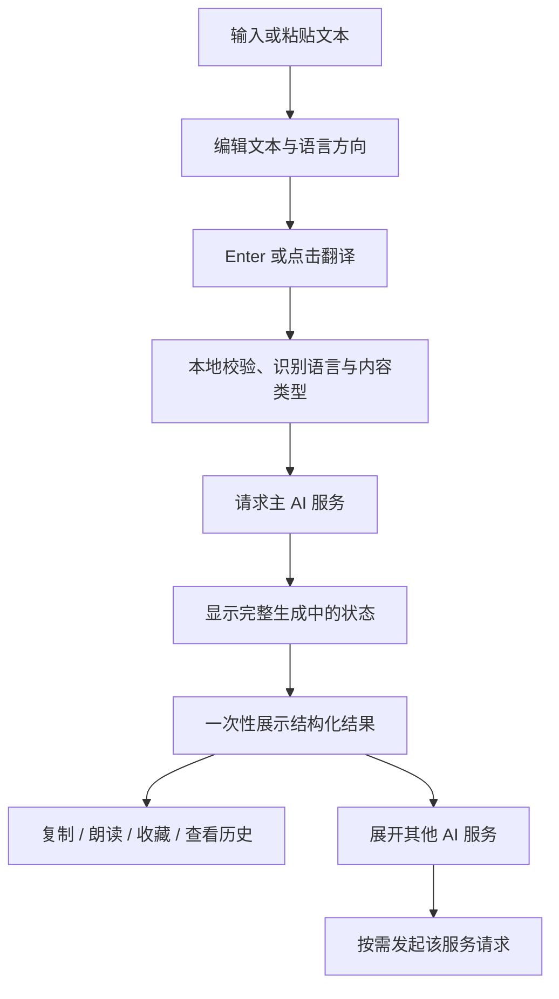

# 文本输入翻译产品需求文档

> 状态：Accepted
> 日期：2026-08-11
> 产品阶段：Phase 1
> 决策来源：产品所有者与 Codex 的需求工作坊
> 上位文档：[阶段一 PRD](./phase-1-prd.md)、[Easydict 功能对齐基线](./easydict-feature-baseline.md)

## 1. 执行摘要

Evolish 将为高频阅读、写作和语言学习场景提供键盘优先的桌面文本输入翻译。用户在主窗口输入或粘贴文本，按 `Enter` 或点击翻译按钮后，由本地逻辑判断文本类型与语言方向，再调用用户配置的主 AI 服务。结果完整生成后一次展示，并根据单词、短语、句子或长文本采用不同的信息结构。

该功能只使用 AI 完成翻译、释义、例句和语言分析，不接入 Google Translate、DeepL、腾讯翻译等传统翻译服务。系统 TTS 可用于朗读，本地能力可用于语言检测和文本处理。查询默认自动写入本地历史并支持收藏，为后续生词本、知识卡与复习系统保留稳定数据，但本阶段不实现复习逻辑。

## 2. 背景与问题

### 2.1 目标用户

首要用户是产品所有者本人，以及具有相似需求的语言学习者和知识工作者：

- 在 macOS、Windows 与 Linux 上频繁查询单词、句子和长文本；
- 希望使用自己选择的 AI 模型，而不是传统翻译平台；
- 需要稳定、可预测、可复用的翻译结果，而非一次性文本；
- 重视键盘效率、费用控制、隐私和后续学习价值。

### 2.2 已确认的使用痛点

- 输入过程自动发起请求会造成误触、额外费用和界面扰动。
- 多服务默认并行会增加费用与等待噪声，不适合日常主服务优先的工作流。
- 传统翻译服务与期望的 AI 解释、语境和学习信息不一致。
- 流式输出持续变化，会干扰阅读完整结果。
- 单词、句子和长文本使用相同的扁平结果结构，学习价值不足。
- 查询记录如果没有稳定保存和收藏，无法自然进入后续学习系统。

### 2.3 用户任务（JTBD）

当我主动输入一段需要理解或翻译的内容时，我希望用一次明确操作获得由首选 AI 生成的完整、结构化结果，并能复制、朗读、保存或收藏，以便立即使用且为以后学习保留价值。

## 3. 产品目标与原则

### 3.1 目标

1. 建立从文本输入到 AI 结构化结果的完整桌面闭环。
2. 让语言方向和结果结构智能适配，同时始终允许用户明确覆盖。
3. 将 AI 请求费用和发起时机交给用户控制。
4. 形成可被历史、收藏和未来学习系统复用的结构化数据。
5. 在三个桌面平台保持一致的核心行为、隐私边界和验收标准。

### 3.2 产品原则

- **明确触发**：只有用户提交才产生翻译请求。
- **主服务优先**：首次只调用一个主 AI 服务，不自动回退或并行扩散。
- **完整后展示**：生成期间显示状态，完整结果到达后原子展示。
- **结构适应内容**：单词、短语、句子和长文本拥有不同结果结构。
- **用户可控**：语言、模型、翻译模式、历史和隐私均可控制。
- **本地优先保管**：内容数据进入本地 SQLite，密钥只进入系统凭据库。
- **面向学习演进**：保存结构和上下文，但不提前暴露未完成的复习功能。

## 4. 范围

### 4.1 本功能包含

- 主窗口的手动输入、粘贴、编辑、清空和提交。
- `Enter` 提交、`Shift+Enter` 换行及输入法组合态保护。
- 本地文本规范化、查询类型判断和源语言识别。
- 主要/次要目标语言驱动的智能语言方向。
- 手动选择、交换和本次查询覆盖语言方向。
- 单词、短语、句子和长文本的自适应结果结构。
- 标准、直译、自然、学术、简洁翻译模式。
- 自定义提示词模板的创建、编辑、排序、启停和选择。
- OpenAI、Anthropic、Gemini 原生协议及 OpenAI-compatible 自定义服务。
- 多个 AI 服务实例、模型、接口地址和主服务设置。
- 主服务请求，以及用户展开后才执行的其他 AI 服务请求。
- 完整生成后一次展示、取消、超时、失败和手动重试。
- 复制原文、译文、单个结构区块或完整结果。
- 使用平台系统 TTS 朗读原文或主要译文。
- 本地翻译历史、搜索、删除、清空、保留策略和隐私模式。
- 一键收藏、取消收藏和收藏筛选。

### 4.2 本功能不包含

- Google Translate、DeepL、腾讯翻译等传统在线翻译服务。
- 传统在线词典参与本功能的翻译或语言分析结果生成。
- 全局快捷键唤起、划词、截图 OCR 和迷你窗口；它们后续复用同一查询核心。侧悬浮窗口已明确排除。
- AI 知识卡、复习队列、间隔重复、测验、课程和学习统计。
- 第三方动态插件、脚本 provider 或运行时二进制扩展。
- 云端账户、跨设备同步或服务端保存翻译历史。
- 移动端界面。

### 4.3 与本地词典能力的边界

MDict 或系统词典属于独立功能，不参与本 PRD 定义的 AI 文本翻译请求和结果拼装。本 PRD 不决定它们是否在 Phase 1 的其他入口中继续存在。

## 5. 核心用户流程

### 5.1 标准查询

1. 主窗口打开后，输入框获得焦点。
2. 用户输入或粘贴文本；输入过程不产生 AI 请求。
3. 系统本地显示预测的源语言、目标语言和内容类型。
4. 用户可以覆盖语言方向或翻译模式。
5. 用户按 `Enter` 或点击“翻译”。
6. 系统校验主服务和请求能力，创建查询会话并显示生成状态。
7. 主 AI 返回完整且通过结构校验的结果后，界面一次性展示。
8. 成功结果自动保存到本地历史。
9. 用户可以复制、朗读、收藏或展开其他 AI 服务。

### 5.2 其他服务按需查询

1. 结果页按用户排序列出其他已启用 AI 服务的折叠项。
2. 未展开的服务不产生网络请求和费用。
3. 用户首次展开某个服务时，系统使用同一原文、语言方向和翻译模式发起请求。
4. 该服务独立显示生成、成功或失败状态，不改变主结果。
5. 已成功的结果再次折叠和展开时直接复用，不重复请求；用户明确点击重试才产生新请求。

### 5.3 新查询替换旧查询

1. 用户可以在请求执行期间编辑并提交新文本。
2. 系统取消旧请求；无法及时取消的返回结果按会话 ID 隔离。
3. 旧结果不得覆盖、追加或改变当前查询。
4. 新查询独立进入校验和生成流程。

## 6. 功能需求

### 6.1 输入与提交

| ID | 需求 |
|---|---|
| TIT-IN-01 | 输入框支持 Unicode、多行文本、粘贴和平台标准编辑操作。 |
| TIT-IN-02 | `Enter` 提交，`Shift+Enter` 插入换行；输入法仍处于组合态时 `Enter` 只确认候选词，不提交。 |
| TIT-IN-03 | 点击翻译按钮与键盘提交行为完全一致。 |
| TIT-IN-04 | 空白输入、仅控制字符或超过当前模型能力的内容不得发起请求，并显示可执行说明。 |
| TIT-IN-05 | 文本规范化不得改变有语义的 Unicode、换行、标点、代码片段或空格结构。 |
| TIT-IN-06 | 不静默截断长文本；超过单请求上下文能力时按自然段分段处理，并在全部分段成功后合并展示。 |
| TIT-IN-07 | 清空输入只清空编辑区；“清空全部”同时清空当前结果，但不删除历史。 |

### 6.2 语言与查询类型

| ID | 需求 |
|---|---|
| TIT-LANG-01 | 默认在本地自动识别源语言，不为语言检测发送外部请求。 |
| TIT-LANG-02 | 用户配置主要目标语言和次要目标语言；源语言等于主要目标语言时使用次要目标语言，否则使用主要目标语言。 |
| TIT-LANG-03 | 混合语言或低置信度输入必须显示“不确定”状态，不伪装为确定识别。 |
| TIT-LANG-04 | 用户可以手动选择源语言和目标语言，手动选择优先于自动规则。 |
| TIT-LANG-05 | 交换语言后保留原文，不自动提交；用户再次明确提交后才请求。 |
| TIT-LANG-06 | 系统将输入分类为单词、短语、句子或长文本；用户可以覆盖分类。 |
| TIT-LANG-07 | 语言目录和统一代码映射继续满足 Phase 1 的 48 种语言基线；服务不支持的语言组合在请求前提示。 |

### 6.3 翻译模式与提示词

| ID | 需求 |
|---|---|
| TIT-MODE-01 | 内置标准、直译、自然、学术、简洁五种模式，并为每种模式提供清晰用途说明。 |
| TIT-MODE-02 | 用户可以创建、复制、编辑、重命名、排序、禁用和删除自定义模板。 |
| TIT-MODE-03 | 内置模板不可被永久破坏；用户修改内置模板时保存为自定义副本。 |
| TIT-MODE-04 | 模板允许表达翻译风格和附加说明，但系统维护的输出结构、安全边界和语言参数不可被模板绕过。 |
| TIT-MODE-05 | 删除正在使用的自定义模板前必须要求选择替代模板。 |
| TIT-MODE-06 | 每次查询保存所用模板 ID、版本和有效配置快照，后续编辑模板不得篡改历史结果。 |

### 6.4 AI 服务管理与请求

| ID | 需求 |
|---|---|
| TIT-AI-01 | 编译期内置 OpenAI、Anthropic、Gemini provider，并支持 OpenAI-compatible 自定义服务。 |
| TIT-AI-02 | 同一 provider 类型可创建多个服务实例，每个实例独立保存名称、地址、模型、参数和凭据引用。 |
| TIT-AI-03 | API Key、Token 等秘密只存入平台凭据库，不进入 SQLite、前端状态、日志、导出文件或诊断包。 |
| TIT-AI-04 | 服务配置支持保存前校验、连通性测试、模型能力说明和可诊断错误。 |
| TIT-AI-05 | 用户必须指定一个已启用的主服务；首次提交只调用该服务。 |
| TIT-AI-06 | 系统不因主服务失败自动调用其他服务；用户明确展开或重试后才产生新请求。 |
| TIT-AI-07 | 其他服务按用户顺序折叠展示，首次展开时才发起请求。 |
| TIT-AI-08 | 请求携带源文本、语言方向、内容类型、模板有效版本和必要模型参数，不携带无关历史内容。 |
| TIT-AI-09 | 服务级超时可配置，默认 120 秒；超时、认证、限额、网络、模型和响应格式错误需要分类显示。 |
| TIT-AI-10 | 用户可取消正在执行的请求；取消后不得保存成功历史或显示迟到结果。 |

### 6.5 自适应结果

| ID | 需求 |
|---|---|
| TIT-RES-01 | AI 响应必须映射到版本化统一结果结构，原始供应商协议不得直接渗透到 UI。 |
| TIT-RES-02 | 单词结果至少包含主要译义、词性、IPA/读音信息、词形、常见搭配和语境例句；无可靠内容的字段省略而非编造占位。 |
| TIT-RES-03 | 短语结果至少包含整体含义、适用语境、自然译法和例句。 |
| TIT-RES-04 | 句子结果至少包含主要译文，并按所选模式提供必要的用词或语法说明。 |
| TIT-RES-05 | 长文本结果保留段落、列表和基础文本结构；分段处理不得打乱顺序。 |
| TIT-RES-06 | 完整响应通过结构与完整性校验后一次展示；生成期间不展示部分正文。 |
| TIT-RES-07 | 响应结构不合法时不展示残缺结果，显示“响应格式错误”并允许用户手动重试。 |
| TIT-RES-08 | 主服务结果默认展开；其他服务默认折叠，并显示未请求、生成中、成功、失败或已取消状态。 |
| TIT-RES-09 | 用户可复制原文、主要译文、单个结构区块或格式化完整结果，复制内容保留 Unicode 和换行。 |
| TIT-RES-10 | 用户可使用系统 TTS 朗读原文或主要译文，并可停止当前朗读。 |

### 6.6 重试与结果一致性

| ID | 需求 |
|---|---|
| TIT-RETRY-01 | 用户可以对主服务或单个其他服务手动重试，不重复调用未选择的服务。 |
| TIT-RETRY-02 | 重试使用当前明确选择的文本、语言、模式、服务和模型配置，并展示配置差异。 |
| TIT-RETRY-03 | 新请求创建新的 attempt ID；旧请求的迟到响应不得改变新 attempt。 |
| TIT-RETRY-04 | 重试期间保留上次成功结果可见，直到新结果完整成功；失败时继续保留上次成功结果并显示本次失败状态。 |
| TIT-RETRY-05 | 每个已完成 attempt 作为同一查询会话下的结果版本保存；界面默认显示最新成功版本，并允许切换旧版本。 |

### 6.7 历史、收藏与隐私

| ID | 需求 |
|---|---|
| TIT-HIS-01 | 每次成功查询自动保存原文、规范化文本、语言方向、内容类型、翻译模式快照、服务、模型、结果版本和时间。 |
| TIT-HIS-02 | 历史仅保存在本地 SQLite，由 Rust storage 层读写。 |
| TIT-HIS-03 | 历史支持按原文、译文、语言、服务、模型、模式、日期和收藏状态搜索或筛选。 |
| TIT-HIS-04 | 用户可以删除单条、批量删除或清空非收藏历史；破坏性操作需要明确确认。 |
| TIT-HIS-05 | 用户可以设置保留期限或永久保留；自动清理不得删除收藏记录。 |
| TIT-HIS-06 | 用户可以关闭自动历史；关闭后仅在主动收藏时保存必要记录。 |
| TIT-HIS-07 | 临时隐私模式不持久化输入、结果、来源上下文或搜索记录；退出模式后不得补写。 |
| TIT-FAV-01 | 成功结果支持一键收藏和取消收藏，状态即时可见。 |
| TIT-FAV-02 | 收藏绑定到明确的查询结果版本，而不是易变的当前界面文本。 |
| TIT-FAV-03 | 取消收藏只改变收藏状态，不自动删除历史。 |
| TIT-FAV-04 | 删除已收藏记录时必须明确说明收藏也将被删除并再次确认。 |
| TIT-FAV-05 | 收藏列表支持搜索、语言筛选、服务筛选和按时间排序。 |

## 7. 用户故事与验收标准

### US-TIT-01：明确提交文本，避免意外费用

- **作为** 高频使用 AI 翻译的学习者
- **我希望** 只在按下 `Enter` 或点击翻译按钮时提交
- **以便** 在编辑过程中不会产生误请求和额外费用

**验收场景：键盘提交**

- **Given** 输入框包含有效文本且输入法不在组合态
- **When** 用户按下 `Enter`
- **Then** 系统只创建一次主 AI 翻译请求

**验收场景：输入法确认候选词**

- **Given** 输入法仍处于组合态
- **When** 用户按下 `Enter` 确认候选词
- **Then** 系统不创建翻译请求

**验收场景：插入换行**

- **Given** 输入框获得焦点
- **When** 用户按下 `Shift+Enter`
- **Then** 输入框插入换行且不创建翻译请求

### US-TIT-02：获得可预测的智能语言方向

- **作为** 经常在主要语言和学习语言之间切换的学习者
- **我希望** 系统自动选择可预测的翻译方向
- **以便** 减少每次查询前的重复设置

**验收场景：源语言不是主要目标语言**

- **Given** 主要目标语言为中文且本地识别源语言为英语
- **When** 用户提交查询
- **Then** 请求语言方向为英语到中文

**验收场景：源语言等于主要目标语言**

- **Given** 主要目标语言为中文、次要目标语言为英语且源语言为中文
- **When** 用户提交查询
- **Then** 请求语言方向为中文到英语

**验收场景：手动覆盖**

- **Given** 用户已手动选择源语言和目标语言
- **When** 用户提交查询
- **Then** 请求使用手动语言方向而不是自动规则

### US-TIT-03：根据内容获得适合的学习结果

- **作为** 同时查询单词、短语和文本的学习者
- **我希望** 结果结构随内容类型变化
- **以便** 获得与当前学习任务相关的信息

**验收场景：单词查询**

- **Given** 输入被分类为单词且 AI 返回有效结构
- **When** 完整响应通过校验
- **Then** 界面一次展示单词译义、词性、读音、词形、搭配和例句中的有效部分

**验收场景：长文本查询**

- **Given** 输入被分类为长文本并包含多个段落
- **When** 完整响应通过校验
- **Then** 译文按原有段落顺序一次展示且不静默丢失内容

### US-TIT-04：选择适合当前任务的翻译方式

- **作为** 有不同写作和学习任务的用户
- **我希望** 选择预设或自定义翻译模式
- **以便** 控制译文风格而不必每次重新编写提示词

**验收场景：使用内置模式**

- **Given** 用户选择“学术”模式
- **When** 用户提交文本
- **Then** 请求使用学术模式的有效模板版本并把该版本记录到历史

**验收场景：修改内置模式**

- **Given** 用户正在编辑一个内置模式
- **When** 用户保存修改
- **Then** 系统创建自定义副本且保留原内置模式

### US-TIT-05：只为明确需要的 AI 服务付费

- **作为** 管理多个付费 AI 服务的用户
- **我希望** 首次只调用主服务，其他服务按需请求
- **以便** 控制费用并减少无关等待

**验收场景：首次提交**

- **Given** 已启用一个主服务和三个其他服务
- **When** 用户提交一次查询
- **Then** 系统只向主服务发送一次请求

**验收场景：展开其他服务**

- **Given** 某个其他服务尚未请求
- **When** 用户首次展开该服务
- **Then** 系统只向该服务发送一次与当前查询一致的请求

**验收场景：主服务失败**

- **Given** 主服务请求失败且其他服务未展开
- **When** 系统处理失败
- **Then** 系统显示可诊断错误且不自动请求任何其他服务

### US-TIT-06：阅读稳定的完整结果

- **作为** 不希望被持续变化文本干扰的用户
- **我希望** AI 完整生成后再展示结果
- **以便** 一次阅读稳定且结构完整的内容

**验收场景：生成期间**

- **Given** AI 请求尚未完成
- **When** 用户查看结果区域
- **Then** 系统只显示生成状态而不显示部分正文

**验收场景：完整成功**

- **Given** AI 返回完整且结构有效的响应
- **When** 响应校验完成
- **Then** 完整结果在一次界面更新中显示

### US-TIT-07：安全替换进行中的查询

- **作为** 会快速修改并重新提交文本的用户
- **我希望** 新查询不会被旧请求污染
- **以便** 始终看到与当前输入一致的结果

**验收场景：旧响应迟到**

- **Given** 查询 A 仍在执行且用户已提交查询 B
- **When** 查询 A 在查询 B 之后返回
- **Then** 查询 A 的结果不出现在查询 B 的界面或历史成功记录中

### US-TIT-08：从失败中明确恢复

- **作为** 使用不稳定网络或受限模型的用户
- **我希望** 看到可理解的失败原因并手动重试
- **以便** 在不产生隐藏请求的前提下恢复工作

**验收场景：认证失败**

- **Given** AI 服务返回认证错误
- **When** 系统完成错误分类
- **Then** 界面显示认证问题并提供进入对应服务配置的操作

**验收场景：手动重试**

- **Given** 当前服务请求失败
- **When** 用户点击该服务的重试
- **Then** 系统只为该服务创建一个新 attempt

### US-TIT-09：复用翻译内容

- **作为** 需要把译文用于阅读或写作的用户
- **我希望** 复制和朗读明确的内容范围
- **以便** 不必手动清理界面文本

**验收场景：复制主要译文**

- **Given** 当前结果包含主要译文和附加分析
- **When** 用户选择“复制主要译文”
- **Then** 剪贴板只包含主要译文并保留 Unicode 与换行

**验收场景：朗读译文**

- **Given** 平台系统 TTS 支持当前目标语言
- **When** 用户点击主要译文的朗读操作
- **Then** 系统使用目标语言的系统语音朗读主要译文

### US-TIT-10：查找过去的翻译

- **作为** 会重复遇到相似内容的学习者
- **我希望** 自动保存并搜索历史结果
- **以便** 无需重复调用 AI 就能找回已有内容

**验收场景：保存成功查询**

- **Given** 自动历史已开启且不在隐私模式
- **When** 主服务结果完整成功
- **Then** 系统在本地保存一条包含查询与结果版本快照的历史记录

**验收场景：隐私模式**

- **Given** 临时隐私模式已开启
- **When** 查询成功并随后退出隐私模式
- **Then** SQLite 和搜索历史中不存在该查询的内容记录

### US-TIT-11：收藏值得学习的结果

- **作为** 希望以后复习重要内容的学习者
- **我希望** 收藏某个明确的翻译结果
- **以便** 未来学习系统能够引用我真正认可的版本

**验收场景：收藏当前结果**

- **Given** 当前显示一个完整成功的结果版本
- **When** 用户点击收藏
- **Then** 系统持久化该结果版本的收藏状态并在收藏列表中可检索

**验收场景：取消收藏**

- **Given** 当前结果已经收藏
- **When** 用户取消收藏
- **Then** 系统移除收藏状态但保留对应历史记录

### US-TIT-12：保护 AI 凭据与私人内容

- **作为** 使用个人 API Key 和私人文本的用户
- **我希望** 凭据和内容遵守明确的本地边界
- **以便** 能够信任应用处理敏感材料

**验收场景：保存服务凭据**

- **Given** 用户输入有效 API Key
- **When** 用户保存服务配置
- **Then** API Key 只写入平台凭据库且不会出现在 SQLite、日志或前端可读取状态中

## 8. 数据边界

至少需要形成以下稳定对象，具体字段由技术设计确定：

- `TranslationSession`：原文、规范化文本、来源入口、内容类型、语言方向、创建时间和隐私状态。
- `TranslationAttempt`：服务、模型、模板版本、请求状态、开始/结束时间、错误分类和结果版本。
- `AdaptiveTranslationResult`：版本化的单词、短语、句子或长文本结构。
- `AiProviderProfile`：provider 类型、用户命名、模型、地址、非秘密参数和凭据引用。
- `TranslationModeProfile`：内置或自定义模式、版本、排序和启用状态。
- `FavoriteReference`：收藏所指向的稳定 session、attempt 和结果版本。

约束：

- SQLite 只由 Rust storage 层访问。
- 前端通过类型化 IPC 获取 DTO，不接触 SQL 或第三方原始响应。
- 凭据引用与实际秘密分离。
- 历史记录必须支持后续 migration，不能只保存不可演进的展示 HTML。
- 供应商原始响应仅在明确的脱敏诊断策略下短期处理，默认不持久化。

## 9. 错误与边界场景

系统至少区分并测试：

- 未配置主服务、主服务被禁用或配置已失效；
- API 凭据缺失或认证失败；
- 网络不可达、代理错误、DNS、TLS 和请求超时；
- 限额耗尽、速率限制、地区限制和模型不可用；
- 不支持的语言方向或文本超过模型上下文；
- AI 返回空内容、截断内容、非法结构或安全拒绝；
- 长文本某一分段失败；
- 用户取消、窗口关闭、新查询替换旧查询；
- 系统 TTS 不支持语言或朗读被中断；
- SQLite 写入失败、历史关闭和隐私模式；
- 收藏目标在清理、迁移或删除时的引用一致性。

任何失败都不得：

- 自动改用其他 AI 服务；
- 静默截断或伪造成功结果；
- 暴露密钥、完整请求头或敏感内容到日志；
- 让旧请求污染当前查询；
- 因保存历史失败而丢失已经成功展示的翻译结果。

## 10. 非功能需求

### 10.1 性能

- 用户提交后，界面进入明确生成状态的本地响应时间 P95 不高于 100ms。
- AI 完整响应到达后，结果完成校验并显示的应用侧时间 P95 不高于 100ms，不计 provider 网络和推理时间。
- 输入编辑、滚动和折叠操作在生成期间保持响应，不阻塞 UI 主线程。
- 长文本分段遵守服务并发与速率限制，不以无限并发换取速度。

### 10.2 可靠性

- 查询会话、attempt 和窗口 generation 共同隔离过期响应。
- 相同用户动作不得因事件重复处理产生重复请求。
- 应用异常退出后，已提交但未完整成功的请求不得被标记为成功历史。
- migration、收藏引用和历史清理必须有事务性测试。

### 10.3 安全与隐私

- 只有用户明确提交或展开服务后才能发送文本到对应 AI 端点。
- 发起请求前，界面可识别将使用的服务和模型。
- 默认不收集外部遥测；未来若增加，必须单独获得用户同意且不得包含查询正文。
- 日志和诊断信息默认脱敏。
- 自定义地址必须通过 URL 和协议校验；生产环境默认要求 HTTPS，本地回环地址可明确使用 HTTP。

### 10.4 可访问性与键盘

- 所有核心操作都可用键盘完成并具有可见焦点。
- 生成状态、错误、收藏状态和折叠状态具备正确的辅助技术语义。
- 颜色不是状态的唯一表达方式。
- 中英文界面均通过布局验收，并保留 RTL 方向能力。

### 10.5 平台一致性

- macOS、Windows、Linux 共享相同的输入、语言、AI 请求、历史和收藏语义。
- 快捷键修饰键、系统 TTS 声音和系统凭据库采用平台原生实现。
- X11 与 Wayland 在本功能的主窗口手动输入路径上应保持功能一致。

## 11. 成功指标与完成定义

### 11.1 核心成功指标

- 固定验收语料中，用户无需手动修正即可得到预期语言方向的比例达到 95% 以上；低置信度内容必须诚实标记。
- 有效提交只产生一次主服务请求；未展开的其他服务请求数必须为零。
- 旧查询污染当前结果的自动化并发测试通过率为 100%。
- 隐私模式、密钥存储和日志脱敏安全测试通过率为 100%。
- 本文全部适用验收场景在 macOS、Windows 和 Linux 通过。

### 11.2 Definition of Done

- [ ] 所有功能需求 ID 都链接到自动化测试或人工验收证据。
- [ ] 固定语料覆盖单词、短语、句子、长文本、混合语言、Unicode、代码和超长文本。
- [ ] OpenAI、Anthropic、Gemini 与 OpenAI-compatible provider 通过共同契约测试。
- [ ] 取消、超时、错误分类、非法响应和过期隔离通过可重复测试。
- [ ] 历史 migration、搜索、保留策略、隐私模式和收藏引用通过 repository 测试。
- [ ] 三个平台完成输入法、剪贴板、系统 TTS 和系统凭据库人工矩阵。
- [ ] API Key 不进入 SQLite、IPC 返回值、日志、诊断包或测试 fixture。
- [ ] `pnpm check`、Rust fmt/clippy/test、Tauri 三平台构建和供应链检查全部通过。
- [ ] UI 截图或录屏证明标准查询、其他服务按需查询、错误、历史和收藏流程。
- [ ] 旧 Phase 1 文档、功能基线、路线图和架构 ADR 已按本 PRD 的 Accepted 决策同步更新。

## 12. 依赖与风险

### 12.1 依赖

- AI provider descriptor、系统凭据库和服务连通性测试。
- 本地语言识别与统一 48 种语言代码目录。
- 版本化结构输出协议和 provider 结构化响应适配。
- SQLite migration、全文搜索策略和历史 repository。
- 平台系统 TTS 适配器。
- 类型化 IPC、错误模型和 React 错误边界。

### 12.2 风险与控制

| 风险 | 控制方式 |
|---|---|
| 不同模型结构化输出能力差异 | provider 能力声明、版本化 schema、契约测试和明确格式错误 |
| AI 生成内容不准确 | 清晰标识服务与模型；允许切换服务、模式和手动重试；不将生成内容标为权威词典 |
| 长文本成本和失败率上升 | 提交前显示文本规模；按自然段分段；不静默截断；遵守并发限制 |
| 自定义提示词破坏结构 | 将用户风格指令与系统结构契约分层，保存前校验 |
| 历史包含敏感内容 | 历史开关、保留策略、隐私模式、本地存储和明确删除 |
| 收藏与未来学习模型耦合 | 收藏只引用稳定结果版本，不提前实现知识卡或复习字段 |
| 旧 Phase 1 基线与新决策冲突 | 本 PRD 接受后以决策记录统一修订，不保留相互矛盾的有效文档 |

## 13. 已确认的产品决策

| 议题 | 决策 |
|---|---|
| 结果组织 | 主 AI 服务优先展示，其他服务折叠 |
| 请求触发 | 仅 `Enter` 或点击按钮；输入过程不自动翻译 |
| 语言方向 | 本地自动识别，依据主要/次要目标语言智能选择，可手动覆盖 |
| 结果结构 | 单词、短语、句子和长文本自适应 |
| 服务边界 | 翻译与语言分析只使用 AI；本地处理和系统 TTS 可用 |
| Provider | OpenAI、Anthropic、Gemini 原生支持，加 OpenAI-compatible 自定义服务 |
| 翻译模式 | 内置模式与可排序的自定义提示词模板 |
| 其他服务策略 | 首次仅请求主服务；其他服务在展开时按需请求 |
| 历史 | 成功结果自动本地保存，支持关闭、清理和隐私模式 |
| 收藏 | Phase 1 提供结果收藏与筛选，但不实现复习系统 |
| 展示时机 | AI 完整生成后一次展示，不使用流式正文 |

## 14. 已确认的补充规则

以下补充规则已由产品所有者在 2026-08-11 一并确认：

1. 重试成功后保留旧结果版本，而不是直接覆盖。
2. 超长文本由应用按自然段自动分段，全部完成后一次展示。
3. 自定义提示词只能调整风格和附加说明，不能覆盖系统结构契约。
4. 关闭自动历史后，主动收藏仍会保存该条必要记录。
5. 本 PRD 只排除传统服务参与文本输入翻译，不直接决定 MDict/系统词典在其他功能中的去留。
